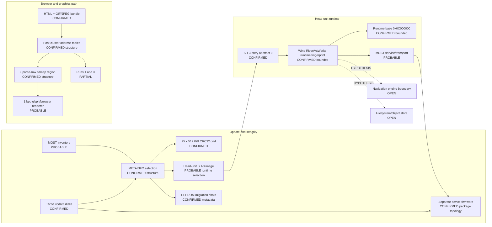

# Session 008 - Firmware operational model and bitmap atlas

- Date: 2026-07-15
- Objective: combine Sessions 001-007 into one confidence-graded firmware model and determine whether the Session 006/007 target is code, generic data or a graphics structure.
- Mode: read-only static and cross-version differential analysis; firmware was never executed.
- Status: COMPLETE for the bounded relocated-region, sparse-row classifier and operational-graph pass.

## Safety gates

The runner verifies both registered ISO hashes and both principal-image hashes before analysis. Selected BIN members exist only in an operating-system temporary directory and are removed afterward. No resource is rendered or exported, and no firmware bytes are included in public output.

Structural and semantic claims use different gates:

- byte equality, relocation, descriptor targeting and measured morphology can confirm a structure;
- a font/glyph label remains `PROBABLE` until a format header, metric table or renderer consumer is decoded;
- the end-to-end graph preserves `OPEN` and `HYPOTHESIS` nodes instead of filling gaps by assumption.

## Confirmed findings

### S008-01 - A 71,245-byte relocated invariant region

A bounded differential scan around the Session 006 block finds one continuous byte-identical region:

| Property | CD1 / 5150 | CD3 / 5570 |
|---|---:|---:|
| Region start | `0xAA4DC` | `0xF95B8` |
| Region end | `0xBBB29` | `0x10AC05` |
| Length | 71,245 bytes | 71,245 bytes |
| Start relative to block | `-0x1F00` | `-0x1F00` |
| End relative to block | `+0xF74D` | `+0xF74D` |

The common SHA-256 is `bb3dc59de9d12e402708eccf169fe236294708298d371aedb67815ecfd0a10ce`. Neither the `0x20000` backward nor forward search bound was reached, so the observed endpoints are caused by cross-version byte differences. They are not yet claimed as vendor segment boundaries.

Status: `CONFIRMED_RELOCATED_INVARIANT_REGION`.

### S008-02 - Sparse one-byte row bitmap morphology

The region was divided into 1,113 complete 64-byte windows. A window is classified as sparse-row bitmap-like only when it has:

- at least 20% zero rows;
- set-bit density from 5% through 30%;
- at least three non-zero row runs;
- median run height from 2 through 12 rows;
- no aligned runtime pointer;
- no recognized SH-3 flow-control halfword.

Results are identical in both releases:

| Measurement | Atlas region | Maximum equal-size control |
|---|---:|---:|
| Candidate windows | 793 / 1,113 | 75 / 1,113 |
| Candidate ratio | 71.2489% | 6.7385% |
| Mean zero-byte ratio | 47.5741% | below 9% in two controls |
| Mean set-bit density | 17.5801% | approximately 37-39% |

The original 256-byte target contains no aligned runtime pointers and no recognized flow-control halfwords. It has 23 non-zero row runs; 17 have height seven. Its zero-byte ratio is 39.8438% and set-bit density is 14.6973%.

Status: `CONFIRMED_RELOCATED_SPARSE_ROW_BITMAP_REGION`.

### S008-03 - Every common descriptor target selects bitmap-like data

All nine normalized fields from the Session 007 descriptor graph point inside the 71,245-byte invariant region. Every 64-byte target window is:

- byte-identical between 5150 and 5570;
- free of aligned runtime pointers;
- free of recognized SH-3 flow-control halfwords;
- positive under the sparse-row bitmap classifier.

This changes the interpretation of the Session 006 block. It is not merely an unknown 16-record table: it is a fixed-stride view into a much larger graphics-like payload.

### S008-04 - Glyph-atlas semantics remain probable

The repeated one-byte row groups, dominant 6-9 row heights, zero separators, low bit density and descriptor-selected subregions strongly support a monochrome glyph/font atlas. However, no font header, character map, metric table or renderer consumer has been decoded.

Status: `PROBABLE_1BPP_GLYPH_ATLAS`, with `semantic_confirmation = false`.

As context only, Wind River documented that its VxWorks/WindML consumer platform supported SuperH and integrations with an embedded browser and font engine. This is consistent with the local evidence but is explicitly not evidence that MMI uses those named third-party components: [Wind River consumer graphics announcement](https://www.windriver.com/news/press/news-277).

## Current operational model



### What the graph now explains

1. The update media is a hardware-aware multi-device migration, not one monolithic firmware replacement.
2. METAINFO describes target tuples, payload integrity, bootloader policy and an exact EEPROM state chain.
3. The principal MMI image is a flat, big-endian SH-3 executable whose bounded runtime mapping uses base `0x0C000000`.
4. The image contains a Wind River/VxWorks platform fingerprint, but a complete task/module table is not known.
5. An embedded browser bundle is followed by runtime-address tables; two exact edges and a normalized descriptor graph lead to a relocated sparse-row bitmap region.
6. Browser/font rendering is the best current semantic explanation, but direct consumer code is still missing.
7. Navigation, persistent storage and address runs 1/3 remain explicit gaps.

## Phoenix SDK 0.6 deliverable

Session 008 adds `phoenix_mmi.operational_model` with:

- bounded equal-region discovery around relocated anchors;
- publication-safe sparse-row bitmap metrics;
- equal-size control-region comparison;
- descriptor-target validation;
- separate structural and semantic classification;
- a machine-readable operational evidence graph;
- a registered-ISO Session 008 runner;
- three synthetic tests, bringing the suite to 24 tests.

## Evidence status

| ID | Status | Claim |
|---|---|---|
| S008-01 | CONFIRMED, BOUNDED | A 71,245-byte invariant region relocates with the known block. |
| S008-02 | CONFIRMED, STRUCTURAL | Sparse one-byte row bitmap morphology dominates the region and differs strongly from controls. |
| S008-03 | CONFIRMED, STRUCTURAL | All nine descriptor targets select equal bitmap-like windows inside the region. |
| S008-04 | PROBABLE | The region is a monochrome glyph/font atlas. |
| S008-05 | NOT CONFIRMED | The renderer consumer, character map and metric schema are unknown. |
| S008-06 | OPEN | Navigation and internal persistent-storage boundaries remain unmapped. |

## Reproduction

```shell
python -m pip install -e .
python -m unittest discover -s tests -v
python tools/session008/build_firmware_operational_model.py \
  MMI-5570-4L0.998.961-cd1-3.iso \
  MMI-5570-4L0.998.961-cd3-3.iso \
  --output research/firmware-5570/work/session008 \
  --public-output research/firmware-5570/session008
```

## Limits

- The equal region is a bounded differential fact, not a confirmed loader segment.
- The bitmap classifier recognizes morphology, not a named font format.
- No glyph bitmap, rendered preview, firmware byte or arbitrary string is published.
- The operational graph composes prior session evidence; it is not an emulator or dynamic trace.
- Indirect address construction and renderer dataflow remain outside the implemented SH-3 subset.
- General Wind River product compatibility is contextual and does not identify the proprietary MMI middleware stack.

## Recommended Session 009

Use the operational graph to attack its highest-value open boundary: navigation and persistent storage. Correlate NAV/GPS/route markers, DVD-facing strings, nearby runtime tables and cross-version relocations without extracting map content. Keep renderer-consumer tracing as RQ-019 unless the navigation pass reveals a shared object/module table.
