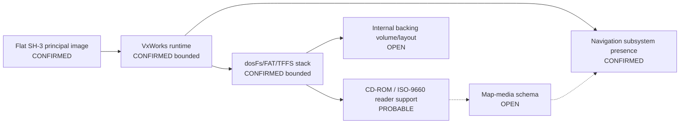

# Session 009 - Navigation and persistent-storage boundary

- Date: 2026-07-15
- Objective: locate navigation and storage responsibilities in the principal MMI image without treating marker strings as module boundaries or publishing map data.
- Mode: read-only static analysis, bounded SH-3 reference analysis and cross-version differential correlation; firmware was never executed.
- Status: COMPLETE for subsystem-presence, marker-band and embedded-volume validation; map-media format and exact module boundaries remain open.

## Safety gates

The runner verifies the registered SHA-256 of both source ISOs and the Session 003 SHA-256 of each selected principal image. Members are extracted only to an operating-system temporary directory and deleted afterward.

The public reports contain a predeclared marker vocabulary, offsets, counts and validator results only. They contain no arbitrary strings, firmware bytes, raw runtime addresses, files from an embedded volume or map payload.

## Method

1. Extract printable ASCII/UTF-16 records locally.
2. Classify them with 27 fixed navigation/storage marker identifiers.
3. Group records with a fixed `0x4000` maximum gap; a cluster requires at least three records.
4. Locate aligned words equal to `0x0C000000 + marker_offset` and decode only exact PC-relative SH-3 `MOV.L` users.
5. Pair records that are text-identical and unique in each release, then build an ordered cross-version band only while both offsets remain monotonic and both gaps are at most `0x4000`.
6. Validate ISO-9660, FAT and UDF structures instead of accepting bare magic strings.

The private text equality key is not included in public output.

## Confirmed findings

### S009-01 - Multiple navigation/storage bands survive 5150 to 5570

The fixed vocabulary matches 1,193 records in CD1 and 1,175 records in CD3. The comparison produces 25 ordered cross-version bands containing 878 paired records:

| Dominant marker domain | Bands | Bands with at least four pairs |
|---|---:|---:|
| Navigation | 14 | 11 |
| Storage | 9 | 8 |
| Mixed navigation/storage | 2 | 2 |

Fifteen bands have one exact relocation delta for every paired record. Other bands preserve order while individual offsets vary, which is consistent with rebuilt code/data but does not establish vendor segment boundaries.

Representative structurally preserved bands:

| Domain | CD1 range | CD3 range | Pairs | Delta model |
|---|---:|---:|---:|---|
| Storage | `0x60098-0x65B07` | `0x5CD50-0x627BF` | 44 | constant `-0x3348` |
| Navigation | `0x1B6C28-0x1B6DE0` | `0x205B6C-0x205D24` | 16 | constant `+0x4EF44` |
| Navigation | `0x616BA8-0x616DDC` | `0x63840C-0x638640` | 27 | constant `+0x21864` |
| Storage | `0x7A4FA8-0x7AE173` | `0x80AA0-0x89C6B` | 36 | constant `-0x724508` |

Status: `CONFIRMED_ORDERED_CROSS_VERSION_MARKER_BAND` for each band. Domain ownership remains `PROBABLE` because a band is an analytical boundary, not a loader/module record.

### S009-02 - Navigation subsystem presence is code-coupled

The image contains coherent families for navigation, routes, destinations, guidance, map/position handling, GPS, waypoints and streets in both releases. More importantly, exact runtime-address literals for fixed marker records have bounded PC-relative SH-3 users:

| Evidence | CD1 / 5150 | CD3 / 5570 |
|---|---:|---:|
| All marker-address literal words | 67 | 40 |
| All decoded PC-relative `MOV.L` referrers | 63 | 28 |
| Navigation-category referrers | 40 | 6 |
| Storage-category referrers | 23 | 22 |

This closes the question of whether the principal image includes navigation code/data responsibilities. It does not reduce those responsibilities to one contiguous module.

Status: `CONFIRMED_CROSS_VERSION_NAVIGATION_SUBSYSTEM_EVIDENCE`.

Boundary status: `PARTIAL_MULTIPLE_RELOCATED_MARKER_BANDS`.

### S009-03 - VxWorks storage support is present

Both releases contain the same core marker families for:

- `dosFs` and FAT12/FAT16/FAT32;
- TFFS flash support;
- CBIO and `BLK_DEV` block interfaces;
- volumes, sectors, directories and mount operations;
- CD-ROM/DVD-facing services.

These families occur in cross-version storage bands and have direct bounded SH-3 references. The local result is consistent with Wind River's description of `dosFs` as FAT-compatible and with its identification of TFFS as True Flash File System support. Those external documents explain the product names only; they do not prove MMI behavior.

Status: `CONFIRMED_CROSS_VERSION_STORAGE_RUNTIME_EVIDENCE`.

### S009-04 - The principal BIN is not an embedded ISO-9660 or FAT volume

Each release contains one `CD001` occurrence. ECMA-119 requires that identifier to be preceded by a volume-descriptor type byte and followed by a version byte. Neither occurrence satisfies that structure, so it is an identifier constant rather than an embedded volume descriptor.

Each image also contains nine `FAT12`, seven `FAT16` and five `FAT32` byte occurrences. None validates as a FAT boot sector under the tested BPB, jump, sector-size, cluster-size, FAT-copy and `0x55AA` checks. No `BEA01`, `NSR02`, `NSR03` or `TEA01` UDF marker is present.

Status: `NOT_FOUND_UNDER_TESTED_ISO9660_FAT_VALIDATORS`.

This is a bounded negative result. It does not say that the running unit lacks a mounted FAT volume; it says the flat principal firmware image does not itself contain a validated ISO-9660 or FAT volume under these validators.

### S009-05 - Operational graph v2 separates code, readers and data media

The graph now has 20 nodes and 22 edges. Thirteen nodes have a `CONFIRMED*` status; two remain `OPEN`:

- the internal backing-volume/object layout;
- the external navigation map-media schema.



The dotted edges remain hypotheses. In particular, the `CD001` constant is not enough to bind the optical reader specifically to the navigation map disc.

## Phoenix SDK 0.7 deliverable

Session 009 adds `phoenix_mmi.navigation_storage` with:

- fixed-vocabulary, publication-safe marker discovery;
- marker clustering and ordered cross-version relocation bands;
- exact runtime-address words and bounded SH-3 `MOV.L` referrers;
- structural ISO-9660, FAT and UDF validation;
- operational graph v2 refinement;
- a registered-ISO Session 009 runner;
- four synthetic tests, bringing the suite to 28 tests.

## Evidence status

| ID | Status | Claim |
|---|---|---|
| S009-01 | CONFIRMED, STRUCTURAL | Twenty-five ordered marker bands survive across 5150 and 5570. |
| S009-02 | CONFIRMED, BOUNDED | Both releases contain code-coupled navigation subsystem evidence. |
| S009-03 | CONFIRMED, BOUNDED | Both releases contain a VxWorks dosFs/FAT/TFFS storage stack. |
| S009-04 | CONFIRMED NEGATIVE, BOUNDED | No embedded ISO-9660 descriptor or FAT volume validates in the principal BIN. |
| S009-05 | PROBABLE | CD-ROM services plus the `CD001` constant support an ISO-9660 reader interpretation. |
| S009-06 | OPEN | Map-media format, backing device and mounted-volume layout are unknown. |

## Reproduction

```shell
python -m pip install -e .
python -m unittest discover -s tests -v
python tools/session009/analyze_navigation_storage_boundary.py \
  MMI-5570-4L0.998.961-cd1-3.iso \
  MMI-5570-4L0.998.961-cd3-3.iso \
  --output research/firmware-5570/work/session009 \
  --public-output research/firmware-5570/session009
```

## External context

- [Wind River VxWorks datasheet](https://www.windriver.com/resource/vxworks-datasheet) - identifies `dosFs` as FAT-compatible.
- [Wind River VxWorks third-party notices](https://labs.windriver.com/downloads/vxw-sr0620-sdk-lab-release/NOTICES/VxWorks7__ThirdPartyNotices_v4.5.pdf) - identifies TFFS/TrueFFS flash support.
- [ECMA-119](https://ecma-international.org/wp-content/uploads/ECMA-119_5th_edition_december_2024.pdf) - defines the `CD001` volume-descriptor field.

These sources provide terminology and validator rules only. Every MMI claim is based on the local registered artifacts.

## Limits

- Marker records and code references prove presence, not a single module boundary.
- A constant relocation delta is not automatically a loader segment.
- The SH-3 decoder still covers only bounded instruction families.
- No mounted live volume, navigation disc or vehicle storage was examined.
- A negative embedded-volume result does not exclude a runtime-mounted external or flash volume.
- No conclusion is made about current-map compatibility.

## Recommended Session 010

Trace the navigation service/dataflow and optical-media contract. Start from the code-coupled navigation marker targets, CD-ROM event/task families and the two stable route-data filename markers. Identify call-site families, buffer/sector interfaces and any stable object descriptors without extracting map content. Keep the map format `OPEN` unless an independently validated navigation medium becomes available.
