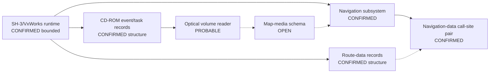

# Session 010 - Navigation dataflow and optical-service contract

- Date: 2026-07-15
- Objective: trace code-coupled navigation-data routines and stable CD-ROM/route-data records without executing firmware or inferring a map schema.
- Mode: read-only static analysis, bounded SH-3 call-site decoding and cross-version relocation normalization.
- Status: COMPLETE for the tested call-site and record-neighborhood models; direct optical dispatch, sector ABI and map-media schema remain open.

## Safety gates

The runner verifies both registered ISO SHA-256 values and both Session 003
principal-image hashes. It extracts one selected member per disc only to an
operating-system temporary directory and removes it after analysis.

Public output contains no firmware or instruction bytes, arbitrary strings,
raw runtime addresses, pointer runs, paths, buffers, map data or extracted
resources. Every semantic search term is represented by a fixed public anchor
ID.

## Method

1. Extract printable records locally and match 13 predeclared anchor types.
2. Use the semantic substring offset rather than the beginning of a printable
   record, avoiding prefixes formed by incidental printable binary bytes.
3. For each anchor, hash a `0x100`-byte neighborhood before and after replacing
   aligned in-image runtime pointers with one fixed token.
4. Locate exact aligned words equal to the confirmed runtime base plus the
   semantic anchor offset.
5. Accept a code user only when the SH-3 decoder computes that exact literal
   location for PC-relative `MOV.L`.
6. Summarize a bounded window around each user; never call it a function.
7. Resolve an indirect target only when an adjacent PC-relative `MOV.L` feeds
   the same register used by `JSR`.
8. Pair anchors, call-site windows and resolved targets between MMI 5150 and
   MMI 5570 by anchor ID and ordinal.

## Confirmed findings

### S010-01 - Two stable navigation-data call-site windows

The focused navigation-data anchor occurs once in each image. It has two exact
linked words and two bounded PC-relative SH-3 referrers per release.

| Evidence | CD1 / 5150 | CD3 / 5570 |
|---|---:|---:|
| Focused anchors | 13 | 13 |
| Navigation-data linked words | 2 | 2 |
| Navigation-data PC-relative referrers | 2 | 2 |
| Unique in-image adjacent-call targets | 5 | 5 |

Both paired call-site windows have equal normalized instruction shapes. Across
them, six adjacent indirect-call pairs resolve. Three target-window pairs are
shape-equal and share the same local relocation delta; three use another common
relocation family but have changed target-window shapes.

Status: `CONFIRMED_CROSS_VERSION_CODE_COUPLED_ROUTINE_PAIR`.

The result confirms stable code coupling, not routine names or function
boundaries.

### S010-02 - Route-data constants are stable relocated records

Both route-data constant occurrences survive from 5150 to 5570. Their complete
`0x100`-byte neighborhoods become identical after aligned in-image runtime
pointers are normalized. The neighborhoods contain respectively three and six
such pointers in each release.

No exact linked-word/PC-relative consumer was found under the tested model.

Status: `CONFIRMED_CROSS_VERSION_RELOCATED_RECORDS_NO_DIRECT_CONSUMER`.

This does not prove which medium supplies those records or which routine opens
them.

### S010-03 - A stable optical-service event/task record family exists

Each release has nine focused optical-service anchors covering manager,
dispatcher, task and event roles. Five corresponding `0x100`-byte
neighborhoods have equal normalized hashes. Four retain the same runtime-pointer
counts but contain changed non-pointer data.

Status:
`CONFIRMED_CROSS_VERSION_RELOCATED_RUNTIME_ADDRESS_NEIGHBORHOODS`.

The term "record" is intentional. No vtable, RTTI or vendor class schema is
claimed.

### S010-04 - Storage-adjacent targets are not a direct optical edge

Three of the six paired adjacent-call targets lie within `0x4000` bytes of
fixed storage markers in both releases. The nearest marker family changes from
mount-oriented context in 5150 to sector-oriented context in 5570, and the
target-window shapes are not equal.

Status: `CONFIRMED_PROXIMITY_WITH_OPEN_FUNCTION_SEMANTICS`.

This is useful negative discipline: the call targets could represent shared
runtime services, allocation/lifecycle helpers or storage routines. Without a
decoded ABI or dataflow into the optical event family, none of those semantics
is promoted.

### S010-05 - Operational graph v3 exposes the remaining contract gap

Graph v3 contains 23 nodes and 27 edges. Sixteen nodes have a `CONFIRMED*`
status and two remain `OPEN`: the internal backing volume and map-media schema.



Dotted edges remain hypotheses. In particular, Session 010 does not confirm a
navigation-to-optical direct call, a sector-read contract or map compatibility.

## Phoenix SDK 0.8 deliverable

Session 010 adds `phoenix_mmi.navigation_dataflow` with:

- fixed and publication-safe contract-anchor discovery;
- semantic-substring offset correction;
- relocation-normalized runtime-address neighborhoods;
- bounded code-window summaries and normalized instruction shapes;
- conservative adjacent `MOV.L`/`JSR` target resolution;
- cross-version contract comparison and operational graph v3;
- five new tests, bringing the suite to 33 tests.

## Evidence status

| ID | Status | Claim |
|---|---|---|
| S010-01 | CONFIRMED, BOUNDED | Two navigation-data call-site windows retain equal instruction shapes across releases. |
| S010-02 | CONFIRMED, STRUCTURAL | Both route-data record neighborhoods are relocation-normalized matches. |
| S010-03 | CONFIRMED, STRUCTURAL | Five optical-service event/task neighborhoods are relocation-normalized matches inside a nine-anchor family. |
| S010-04 | CONFIRMED PROXIMITY | Three resolved call-target pairs are storage-marker-adjacent; function semantics remain open. |
| S010-05 | NOT CONFIRMED | No direct navigation-to-optical edge or sector-read ABI is established. |
| S010-06 | OPEN | Map-media filesystem, database format and compatibility boundary are unknown. |

## Reproduction

```shell
python -m pip install -e .
python -m unittest discover -s tests -v
python tools/session010/analyze_navigation_dataflow.py \
  MMI-5570-4L0.998.961-cd1-3.iso \
  MMI-5570-4L0.998.961-cd3-3.iso \
  --output research/firmware-5570/work/session010 \
  --public-output research/firmware-5570/session010
```

## External context

- [Renesas SH-3/SH-3E/SH3-DSP Software Manual](https://www.renesas.com/en/document/mas/sh-3sh-3esh3-dsp-software-manual?language=en) - defines PC-relative loads, register-targeted `JSR` and delayed control flow.
- [Wind River VxWorks datasheet](https://www.windriver.com/resource/vxworks-datasheet) - identifies `dosFs` as FAT-compatible.
- [ECMA-119](https://ecma-international.org/wp-content/uploads/ECMA-119_6th_edition_december_2025.pdf) - defines CD-ROM sectors, logical blocks and volume recognition.

These primary sources provide instruction and storage terminology only. All MMI
claims come from the registered local artifacts.

## Limits

- The decoder intentionally covers only selected SH-3 instruction families.
- Windows are not functions, and exact anchor references are not object
  ownership proof.
- Non-adjacent register flow, virtual dispatch and queue/message flow are not
  resolved.
- No map disc, live mounted volume or vehicle was examined.
- No conclusion is made about newer maps or conversion feasibility.

## Recommended Session 011

When a legally obtained map ISO is available, inventory it read-only and
independently: validate ISO/UDF structures, volume topology, file-size and
entropy distributions, stable database signatures and version metadata. Do not
publish map files or payload bytes. Only after the medium model is established
should its names/structures be correlated with the open firmware-side route and
optical contracts.
