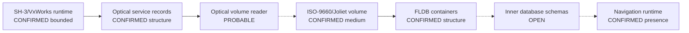

# Session 011 - Navigation optical volume and FLDB containers

- Date: 2026-07-20
- Objective: inventory one locally supplied navigation DVD image, identify its
  outer storage structures and correlate them conservatively with the
  firmware-side optical contract from Session 010.
- Mode: read-only static analysis; no database extraction, execution,
  modification, repacking or vehicle access.
- Status: COMPLETE for the ISO/Joliet volume and FLDB record-table model;
  provenance, inner payload schemas, firmware parser and compatibility remain
  open.

## Safety gates

The runner verifies the registered size and SHA-256 of the navigation image,
both firmware ISO hashes and both Session 003 principal-image hashes before
correlation. Firmware members exist only in an operating-system temporary
directory and are removed after the run.

The committed reports contain no map or firmware bytes, filenames, internal
database names, local paths, raw metadata strings, raw opaque fields, extracted
resources or arbitrary string inventories. Outer files receive generated
`member-NNN` identifiers; inner entries are reduced to counts and suffix
classes.

The navigation artifact is registered as:

| Artifact ID | Size | SHA-256 | Provenance |
|---|---:|---|---|
| `nav-dvd-ee-2018-2019-001` | 2,571,048,960 | `d11a56b2ee46de0d05548b2d6e8bf3b3b10f8d89e15e117b2ab1bcb4569cb0e3` | local, unverified |

The marketed `2018-2019` label comes from the local filename and is not treated
as authenticated release metadata.

## Method

1. Verify the registered artifact size and SHA-256.
2. Parse the ECMA-119 descriptor sequence and validate both-endian volume
   fields.
3. Inventory root entries without extracting them and verify extent topology.
4. Parse every outer member as an FLDB candidate from its fixed header.
5. Validate the directory offset, record count, 36-byte record width, ASCII
   name field, payload ranges, sector alignment, ordering and overlap.
6. Aggregate only suffix families, timestamps, entropy samples and fixed marker
   counts.
7. Test the opaque four-byte record field against CRC32/IEEE and Adler-32 on a
   deterministic bounded sample.
8. Re-probe the CD1 and CD3 principal firmware images for a fixed FLDB
   vocabulary and join the result with operational graph v3.
9. Repeat the complete run and compare public reports byte for byte.

## Confirmed findings

### S011-01 - A simple ISO-9660/Joliet volume is present

The volume descriptor sequence is:

```text
Primary Volume Descriptor
Supplementary Volume Descriptor with Joliet level-3 escape
Volume Descriptor Set Terminator
```

The logical block size is 2,048 bytes. The declared volume size equals the
artifact size exactly. Seven files and no subdirectories are present in the
root. Their extents are contiguous from sector 25 through the declared end of
the volume.

UDF recognition markers were not found in sectors 16-255. This is a bounded
negative result, not a claim about every possible non-standard descriptor.

Status: `CONFIRMED_ISO9660_WITH_JOLIET`.

### S011-02 - Seven structurally valid FLDB containers are present

All seven outer files share a fixed little-endian header:

```text
+0x00  u32  directory offset
+0x04  u32  variant
+0x08  u32  Unix timestamp
+0x0C  u32  entry count
+0x10  u32  record size
+0x14  4 B  "FLDB"
```

For this artifact, the directory offset is `0x220` and the record size is 36
bytes. Every directory record follows:

```text
+0x00  u32  payload offset
+0x04  u32  payload size
+0x08  24 B NUL-padded ASCII name
+0x20  4 B  unresolved opaque field
```

The seven tables contain 3,599 records. Every payload offset is 2,048-byte
aligned, every range is in bounds, no physical ranges overlap and no
case-folded names duplicate. The record payloads account for 2,567,005,806
bytes.

The raw FLDB marker occurs more often than the seven validated headers.
Therefore a marker hit alone is not accepted as a container; structural
validation is mandatory.

Status: `CONFIRMED_FLDB_HEADER_AND_FIXED_RECORD_TABLE`.

### S011-03 - Payload families are inventoried, not decoded

| Generated member | Records | Probable profile from suffix family |
|---|---:|---|
| `member-001` | 1 | GPS resource |
| `member-002` | 1 | GPS resource |
| `member-003` | 7 | location-table bundle |
| `member-004` | 3,577 | map-component bundle |
| `member-005` | 1 | single database payload |
| `member-006` | 4 | runtime-update bundle |
| `member-007` | 8 | speech-resource bundle |

Across all records, 3,462 entries use the dominant `suffix-xac` class. The
remaining classes and counts are available in the public JSON report.

These profile labels are only
`PROBABLE_FROM_SUFFIX_FAMILY`. No inner binary grammar, coordinate encoding,
index, routing graph, compression method or consumer ABI has been confirmed.

The four-byte opaque record field did not match CRC32/IEEE or Adler-32 for the
bounded first/middle/last sample where payload size permitted testing. This is
not proof that it is not an integrity field.

### S011-04 - Metadata yields a timeline, not authenticity

The payload-head timestamp candidates span 2017-05-10. Valid FLDB header
timestamps extend through 2017-08-16. ISO authoring metadata reports
2018-02-15.

The application-identifier family indicates UltraISO authoring. This means the
local image cannot be represented as a bit-for-bit authenticated OEM master
from the available evidence. The timeline is internally plausible, but it does
not authenticate the marketed year range or regional label.

Status:
`UNVERIFIED_PROVENANCE_ULTRAISO_AUTHORED_IMAGE`.

### S011-05 - The firmware/media bridge remains incomplete

Fresh fixed probes found no FLDB magic, database-header marker, release-family
marker or dominant suffix marker in either principal firmware image. The exact
route-data filename marker from Session 010 is also absent from the navigation
medium under the tested ASCII forms.

The firmware independently contains an optical-service contract; the medium
independently confirms an ISO/Joliet filesystem and FLDB containers. That makes
filesystem-level compatibility probable, but it does not identify:

- the firmware FLDB parser;
- the sector-read ABI;
- the inner payload consumer;
- a direct route-record-to-medium edge;
- dynamic compatibility with this or any modified/newer database.

Operational graph v4 contains 26 nodes and 31 edges. Nineteen nodes have a
`CONFIRMED*` status; the internal backing volume remains `OPEN`, while the map
medium is now `PARTIAL_CONFIRMED_OUTER_FORMAT`.



Dotted edges remain hypotheses or probable compatibility relations.

## Phoenix SDK 0.9 deliverable

Session 011 adds:

- descriptor-sequence and volume-metadata support to `iso9660`;
- `phoenix_mmi.map_media`;
- bounded, no-extraction FLDB parsing and validation;
- deterministic entropy, timestamp, suffix and fixed-marker aggregates;
- CRC32/IEEE and Adler-32 opaque-field probes;
- firmware/media correlation and operational graph v4;
- four new tests, bringing the suite to 37 tests.

## Determinism and publication audit

The complete analysis was run twice. Both committed public files were identical
byte for byte:

| Public report | SHA-256 |
|---|---|
| `navigation-media.public.json` | `f3e63b845db73e7cc55c7b65d07ae4159505d0ea2906ee5b54a21af3c55dbcdc` |
| `firmware-media-contract.comparison.json` | `25c0523a1b259956e39fc3d74f778d19083374fda1c379ff1657e1c7e585dbc3` |

A fixed forbidden-string audit found no local ISO filename, outer/internal
database filename, firmware source path or drive-qualified local path.

## Reproduction

```shell
python -m pip install -e .
python -m unittest discover -s tests -v
python tools/session011/analyze_navigation_media.py \
  "<local-navigation-image>.iso" \
  --artifact-id nav-dvd-ee-2018-2019-001 \
  --firmware-cd1 MMI-5570-4L0.998.961-cd1-3.iso \
  --firmware-cd3 MMI-5570-4L0.998.961-cd3-3.iso \
  --output research/navigation-media/work/session011 \
  --public-output research/navigation-media/session011
```

## External context

- [ECMA-119](https://ecma-international.org/wp-content/uploads/ECMA-119_6th_edition_december_2025.pdf)
  defines the ISO descriptor and logical-block terminology used here.
- [Harman Becker patent US8886599B2](https://patents.google.com/patent/US8886599B2/en)
  supplies only general context that a vehicle navigation database can reside
  on removable CD/DVD media.

Neither source documents Audi's FLDB grammar. All FLDB claims in this report
come from reproducible static evidence in the registered local artifact.

## Limits and next step

- Image provenance and marketed release metadata are not authenticated.
- Inner payload formats and the opaque record field remain unresolved.
- Fixed lexical probes cannot disprove an indirect, compressed or table-driven
  parser.
- No read trace, device call, runtime dispatch or vehicle behavior was observed.
- Compatibility with newer, converted or modified map data is not established.

Recommended Session 012: select small bounded representatives from each suffix
family, classify their headers and index relationships locally, and trace
sector-size/offset arithmetic from the firmware optical records toward a
candidate FLDB consumer. Continue publishing only schemas and aggregate
evidence, never payload bytes or extracted map resources.
