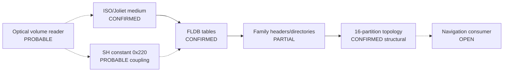

# Session 012 - Payload partitions and firmware parser constants

- Date: 2026-07-20
- Objective: validate bounded inner navigation-payload structures and search the
  CD1/CD3 principal images for conservative static bridges to the FLDB grammar.
- Mode: read-only static analysis; no payload extraction, execution,
  modification, repacking or vehicle access.
- Status: COMPLETE for family signatures, two directory grammars, the speech
  index/data split, the 16-partition topology and the bounded constant scan.
  Parser semantics, sector ABI and map compatibility remain open.

> **Correction from Session 013:** bounded register dataflow proves that the two
> `0x220` references described here pass an expected value to a memory-mapped
> probe call; they do not use it as an FLDB table offset. The historical
> `PROBABLE` classification below is superseded by
> `DISPROVED_FOR_SESSION012_REFERENCE_PAIR`. See SPEC-022.

## Safety gates

The runner verifies the registered map ISO size and SHA-256, both firmware ISO
hashes and both Session 003 principal-image hashes. It reads at most 64 KiB from
the start of each FLDB payload and never extracts map members. Firmware members
exist only in an operating-system temporary directory and are deleted after the
run.

Committed reports contain no map or firmware bytes, local paths, outer or inner
filenames, raw payload headers, raw metadata strings, timestamps, opaque-field
values or extracted resources. Format families receive generated IDs.

## Method

1. Parse all seven previously validated FLDB tables and visit all 3,599 records.
2. Classify a bounded prefix by fixed offset-zero family signature.
3. Validate size/header invariants and standard start signatures.
4. Validate big-endian B/V directory records for monotonicity, non-overlap and
   bounds.
5. Validate declared text-index/binary-data splits and numeric reference ranges
   in speech payloads.
6. Read the XAC header size, two timestamp-field shapes, first subrecord type and
   partition identifier without publishing field contents.
7. Build an anonymous cross-family topology from numeric filename structure,
   never publishing the names.
8. Test every opaque FLDB field against common name-hash and structural models.
9. Scan each SH-3 principal image once for exact PC-relative `MOV.L` loads of
   `0x220`, 36 and 2,048, then pair only equal normalized instruction windows.
10. Preserve parser, partition-consumer and sector-ABI edges as open unless
    direct code semantics establish them.

## Confirmed findings

### S012-01 - Fifteen payload families have stable headers

All 3,599 records match the expected offset-zero signature for their suffix
class. No payload begins with ELF, gzip, SQLite 3, xz or ZIP under the fixed
start-signature probe.

Four index-like families use a big-endian length at offset 16 equal to total
size minus 20 in all 49 instances. The single XAH and GDB families expose stable
header spans of 140 and 32 bytes respectively. Four update-image payloads carry
a bounded masked header and a big-endian total-size field that matches exactly.

Status: `PARTIAL_PROPRIETARY_FAMILY_HEADERS_AND_DIRECTORIES`. These are
structural grammars, not decoded routing or coordinate semantics.

### S012-02 - B/V directories are fixed-width and internally consistent

The B family uses 16-byte directory records and the V family uses 12-byte
records. In both cases:

```text
directory length = 4 + record count * record stride
```

All 65 payloads have version 1 directories with ordered, non-overlapping,
in-bounds ranges whose first payload follows the table. B record counts range
from 28 to 1,731 across 17 distinct counts; V counts range from 28 to 317 across
16 distinct counts.

Status: `CONFIRMED_BIG_ENDIAN_FIXED_RECORD_DIRECTORY`.

### S012-03 - The medium has a cross-family 16-partition topology

All 3,462 XAC records have a 176-byte header, two fixed-shape timestamp fields,
first subrecord type 2 and a partition ID in `0..15`. Every partition is
represented.

Three index families independently form complete 16-element partition sets.
B and V independently form complete `16 partitions x 2 levels` sets; B has one
additional unpaired singleton. This agreement is stronger than a suffix-only
profile and confirms the structural partition graph, while the meaning of each
partition and the runtime consumer remain unknown.

Status: `CONFIRMED_CROSS_FAMILY_16_PARTITION_TOPOLOGY`.

### S012-04 - Speech payloads declare their own split

All eight speech-family payloads contain a text index followed by binary data.
Their declared index and data sizes sum to the enclosing FLDB payload size;
every numeric reference checked against the declared binary-data area remains
in bounds. Indexes contain 230-530 lines and 220-520 numeric-reference rows.

Status: `CONFIRMED_DECLARED_TEXT_INDEX_AND_BINARY_DATA_SPLIT`. Encoding,
phoneme grammar and firmware consumer remain open.

### S012-05 - Common opaque-field models do not explain the field

All 3,599 four-byte opaque values are non-zero and unique. Neither byte order
matches CRC32/IEEE or Adler-32 of the raw, lower-case, upper-case or NUL-padded
24-byte name. The values also do not equal payload offset, size, end or record
ordinal.

Status: `COMMON_NAME_HASH_AND_STRUCTURAL_MODELS_NOT_CONFIRMED`. This is a
bounded negative, not proof that the field is not a checksum, identifier or
seeded hash.

### S012-06 - `0x220` is probably coupled to stable firmware code

Both principal images contain two exact SH `MOV.L` references to `0x220`. The
two code windows pair across releases with the same normalized instruction
shapes, the same relocation delta, known-instruction ratios of 0.697917 and
0.65625, and one shared literal-pool word in each release.

This supports `PROBABLE_CROSS_VERSION_CODE_COUPLED_CONSTANT`. It does not prove
that the routine parses FLDB: there is no direct buffer origin, field load,
loop bound or optical-read call in the established evidence chain.

The constants 36 and 2,048 occur in lower-confidence or non-unique contexts.
Their relation to the FLDB record width and logical sector size remains
`BOUNDED_AMBIGUOUS`.

## Updated operational picture

Operational graph v5 has 29 nodes and 35 edges: 21 nodes have a `CONFIRMED*`
status and five have a `PROBABLE*` status. The only literal `OPEN` node remains
the unresolved internal backing volume; additional open semantics are explicit
properties on partial/probable nodes and edges.



Solid edges are confirmed physical structure. Dotted edges remain probable or
hypothetical runtime relations.

## Phoenix SDK 0.10 deliverable

Session 012 adds:

- `phoenix_mmi.map_payload` for bounded family-header, directory, speech-index,
  partition and opaque-field analysis;
- `phoenix_mmi.parser_contract` for one-pass SH constant loads,
  relocation-normalized comparison and graph v5 correlation;
- a hash-gated Session 012 runner;
- five new unit tests, bringing the suite to 42 tests.

## Determinism and publication audit

The complete map/firmware analysis was run twice. All five public files were
identical byte for byte:

| Public report | SHA-256 |
|---|---|
| `navigation-payload-families.public.json` | `8ee715e946908eb7cfa77fcdfde0e26ba5edd4dd52a7b454da37f3fe82eb0e43` |
| `cd1-parser-constants.public.json` | `5d12f71eb7b061b13f0bc9d1f0d425e16861c294d278199cf72328c8774060fc` |
| `cd3-parser-constants.public.json` | `fd0b3d71a0e5d3583247fe0c3aa3d0297144e6ab5d9c2ce1e973c4ee31c5065e` |
| `cd1-cd3.parser-constants.comparison.json` | `8b7640351ba1efdb93d587e2377246cfe97ae6f220d5776233f31e931a3c6f49` |
| `firmware-payload-parser.comparison.json` | `d31c9a5f7d2f30136976d04ab0dd55e2a08049ade868a4ab447d8d180f91da48` |

A fixed forbidden-string audit found no local ISO filename, principal-member
name, internal payload name or drive-qualified local path in these reports.

## Limits

- The local navigation image has unverified provenance.
- Numeric filename topology confirms structure, not geographical semantics.
- A constant equal to an on-media offset is not proof of a parser.
- No function boundary, FLDB field-access loop, sector-read ABI or dynamic trace
  has been established.
- Routing graphs, coordinates, compression, phoneme encoding and partition
  ownership remain unknown.
- Compatibility with converted, newer or modified maps is not established.

## External context

- [Harman Becker US8886599B2](https://patents.google.com/patent/US8886599B2/en)
  provides only general context for removable navigation databases.
- [Harman Becker EP0865014B1](https://patents.google.com/patent/EP0865014B1/en)
  provides only general context for database-derived speech lexicons.
- [US9507808B2](https://patents.google.com/patent/US9507808B2/en) describes later
  tiled/partitioned navigation data; it is not evidence that this artifact uses
  NDS.
- [Renesas SH-3 software manual](https://www.renesas.com/en/document/mas/sh-3sh-3esh3-dsp-software-manual?language=en)
  defines the instruction semantics used by the static scanner.

None of the patents documents the local artifact grammar. All Session 012
claims come from reproducible static evidence.

## Next step

Recommended Session 013: follow the two high-confidence `0x220` windows through
bounded control flow and dataflow, looking for a base buffer, fields at
`0x00..0x14`, 36-byte stepping and an optical read/service call. In parallel,
map XAC/B/V partition identifiers through offset tables without decoding or
publishing payload content. No repacking or vehicle test should begin.
