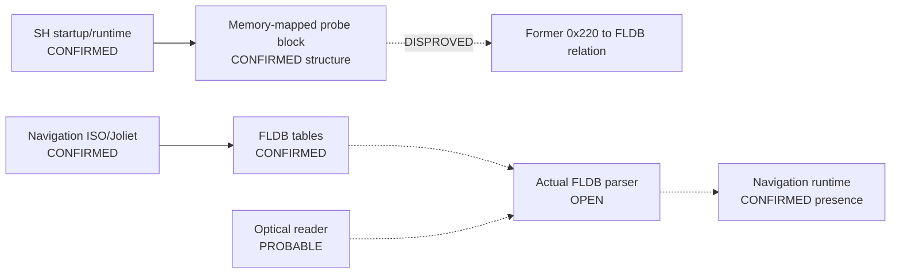

# Session 013 - Corrected FLDB parser candidate dataflow

- Date: 2026-07-21
- Objective: follow the two high-confidence `0x220` references through bounded
  SH register dataflow and determine whether they implement FLDB offset
  arithmetic.
- Mode: read-only static analysis; no firmware or map execution, modification,
  repacking, database extraction or vehicle access.
- Status: COMPLETE for the traced candidate. The Session 012 FLDB interpretation
  is disproved for this reference pair; the real parser and sector ABI remain
  open.

## Why this correction matters

Session 012 correctly established two stable cross-version SH references to the
numeric value `0x220`, but classified their FLDB relation only as probable. The
new decoder and register slice expose the local semantics: the value is not
added to a database buffer and is not used as a pointer. It is passed as an
expected value or selector to a shared call inside a memory-mapped probe block.

The project keeps the original Session 012 report as chronological evidence and
records this correction explicitly. A reproducible disproof is more valuable
than preserving an attractive hypothesis.

## Safety gates

The runner verifies both update-disc hashes, both Session 003 principal-image
hashes and both Session 012 constant-report hashes. Selected firmware members
exist only in an operating-system temporary directory and are removed after the
run.

Public reports contain no firmware bytes, instruction bytes, absolute
memory-mapped addresses, raw strings, local paths, map payloads or extracted
resources. File-relative evidence offsets and derived base-relative deltas are
retained for reproducibility.

## Method

1. Expand the SH decoder only with instruction families documented by Renesas
   and present in the bounded block.
2. Locate the nearest save/prologue sequence without asserting a full function
   boundary.
3. Bound the code at the first referenced literal-pool address.
4. Decode every aligned instruction in the 212-byte body.
5. Find calls where a PC-relative literal is loaded into `r4`, followed by
   `JSR @r10` and its delay slot.
6. Slice `r5`, `r8`, `r9` and `r10` backward through supported register moves,
   immediate additions and PC-relative literal loads.
7. Classify values only by argument role and relative pointer delta; redact
   absolute memory and callee addresses.
8. Compare raw block hashes, normalized instruction shapes and call topology
   between CD1 and CD3.
9. Search the bounded block for the FLDB record width, sector size and magic.
10. Correct operational graph v5 without promoting any replacement parser.

## Confirmed findings

### S013-01 - One byte-identical relocated probe block exists

The bounded body is 212 bytes and 106 SH instructions in both releases. All 106
instructions are decoded under documented encodings. The raw block SHA-256 and
normalized instruction-shape SHA-256 are identical across CD1 and CD3; its
file-relative relocation delta is `-324864`.

The block has a bounded register-save prologue, one high non-image
memory-mapped base and seven fixed mixed-bit probe-pattern literals. These facts
confirm its structure, but not a complete function boundary.

Status: `CONFIRMED_BYTE_IDENTICAL_RELOCATED_STRUCTURE`.

### S013-02 - `0x220` is an expected-value argument, not an offset

The block makes six calls through the same register:

| Expected value in `r4` | Call count | Pointer in `r5` |
|---:|---:|---:|
| `0x1F8` | 2 | fixed base + `0x10` |
| `0x220` | 2 | fixed base + `0x1A` |
| `0x204` | 2 | fixed base + `0x1A` |

After every call, `r0` is immediately tested. The observed `r4`/`r5` roles are
consistent with the documented SuperH register-argument convention. The exact
callee target is deliberately not assigned to the confirmed principal-image
link model.

Because `0x204` is an alternative value at exactly the same pointer as `0x220`,
and neither value participates in additive address arithmetic, the former FLDB
interpretation is rejected.

Status: `DISPROVED_FOR_SESSION012_REFERENCE_PAIR`.

### S013-03 - The real FLDB parser was not found in this block

Inside the candidate body:

- `0x220` is never added to a buffer and is never used as a pointer;
- 36 is absent from the referenced literal set;
- 2,048 is absent from the referenced literal set;
- the FLDB marker is absent;
- no 36-byte record loop or optical-sector call is established.

These are bounded negatives for this 212-byte block only. They do not prove that
the principal image lacks an FLDB parser elsewhere.

Status: `NOT_FOUND_IN_TRACED_CANDIDATE`; global parser search remains `OPEN`.

## Corrected operational graph

Operational graph v6 contains 30 nodes and 37 edges. It has 22
`CONFIRMED*` nodes, four `PROBABLE*` nodes, two literal `OPEN` nodes and one
explicitly `DISPROVED` edge.

The parser and optical edges remain dotted hypotheses. No alternative candidate
is promoted to replace the rejected one.

## Phoenix SDK 0.11 deliverable

Session 013 adds:

- documented SH indirect, pre/post-increment, displaced-load, comparison,
  arithmetic and logic instruction families;
- `phoenix_mmi.parser_dataflow`;
- bounded register slicing for `r4`/`r5`/`r8`/`r9`/`r10`;
- byte/hash and call-topology comparison across releases;
- corrected parser correlation and operational graph v6;
- a hash-gated Session 013 runner;
- five new tests, bringing the suite to 47 tests.

## Determinism, compatibility and publication audit

The complete Session 013 runner was executed twice. All four public files were
identical byte for byte:

| Public report | SHA-256 |
|---|---|
| `cd1-fldb-candidate-dataflow.public.json` | `a852d5ddf3a5162b212f7dfc3c016ab94d48faa7ae15e86ac30d497b384e26a6` |
| `cd3-fldb-candidate-dataflow.public.json` | `d6ac717c8a48bba83d39e7a03fda5486db18f71788f94b5bdd01e7d00e245d39` |
| `cd1-cd3.fldb-candidate-dataflow.comparison.json` | `888a14469d28c865f3346afd8cc680e84f6ba8c8aad2ab935e1343aaa7faa7af` |
| `corrected-parser-correlation.json` | `f539f63b34c314d122f57d4885081d4d5d08c620e26aa890b200999dc9a2ee30` |

The default SH decoder was deliberately left unchanged. The opt-in extended
profile therefore preserves byte-identical regeneration of both Session 012
constant reports. A forbidden-string audit found no local ISO/member names,
drive paths, absolute memory base, low callee literal, raw probe patterns or
nearby raw string in the Session 013 JSON files.

## Limits

- Probable boot-memory or hardware-probe semantics are not a component name.
- A bounded prologue and literal-pool end do not prove a complete function
  boundary.
- The low callee literal is outside the confirmed `0x0C000000` principal-image
  link model; its implementation is unresolved.
- The analysis does not establish the optical dispatch chain, sector-read ABI,
  endian conversion, partition consumer or routing schema.
- Compatibility with regenerated, newer or modified maps remains unestablished.

## External technical basis

- [Renesas SH-3/SH-3E/SH3-DSP Software Manual](https://www.renesas.com/en/document/mas/sh-3sh-3esh3-dsp-software-manual?language=en)
  defines the instruction encodings, delayed calls, comparisons and register
  addressing used by the decoder.
- [Renesas SuperH compiler application note](https://www.renesas.com/en/document/apn/superh-cc-compiler-package-application-note)
  documents register parameter assignment beginning at `r4`.

These sources define ISA and ABI context; all artifact claims come from the
registered local firmware images.

## Next step

Recommended Session 014: perform a global, multi-signal parser search rather
than another single-constant search. Rank only cross-version windows that
combine several independent signals: `add #36`, clustered accesses compatible
with FLDB header offsets, little-endian conversion, bounded loops and proximity
or dataflow to the optical-service contract. A candidate must demonstrate buffer
origin before it can be called a parser.
