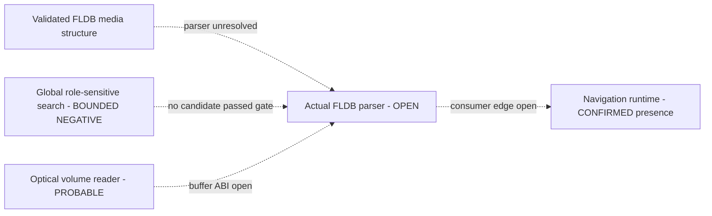

# Session 014 - Global role-sensitive FLDB parser search

- Date: 2026-07-21
- Objective: search both principal MMI images for the actual FLDB parser using
  several independent static signals instead of a single numeric constant.
- Mode: read-only static analysis; no firmware or map execution, modification,
  extraction, repacking or vehicle access.
- Status: COMPLETE for the documented promotion gate. No candidate satisfies
  the parser contract; the parser and optical sector ABI remain open.

## Scope and safety gates

The runner verifies both update-disc hashes and both Session 003 principal-image
hashes. Selected members exist only in an operating-system temporary directory
and are removed after the run.

Public reports contain no firmware bytes, instruction bytes, runtime addresses,
raw strings, local paths, navigation payloads or extracted resources. They retain
file-relative evidence offsets, hashes, structural roles and aggregate counts.

## Promotion gate

A numeric `36` match is only a seed. A candidate can advance only when the
following evidence agrees:

1. `36` is the step of a backward SH loop, not merely a field displacement;
2. the stepped pointer reads records rather than only constructing them;
3. several FLDB header-compatible offsets are read from one base;
4. little-endian handling is visible directly or through a validated helper;
5. the structure is stable across CD1 and CD3;
6. provenance from a verified optical input buffer is established.

The last item cannot be replaced by proximity to an optical or navigation
marker.

## Method

1. Scan every aligned SH halfword for `add #36` and `mov #36` roles.
2. Retain only `add #36` instructions used in the delay slot of a backward
   branch as exact loop-step candidates.
3. Decode each bounded loop and a small surrounding window.
4. Separate loads and stores through the stepped register.
5. Measure same-base accesses to offsets `0`, `4`, `8`, `12`, `16` and `20`.
6. Count explicit `SWAP.B`, `SWAP.W` and `XTRCT` endian operations.
7. Check the bounded window for `0x220` and 2,048 literals.
8. Relate each candidate conservatively to the registered Session 010 contexts.
9. Pair CD1/CD3 loops by normalized loop shape and raw-loop hash.
10. Separately screen the confirmed navigation call-site band for cases where
    `36` appears attractive but has a different dataflow role.

## Confirmed findings

### S014-01 - Numeric role census is broad

| Role | CD1 | CD3 |
|---|---:|---:|
| `add #36` | 2,962 | 2,892 |
| `mov #36` | 605 | 541 |
| `add #36` in a call delay slot | 234 | 299 |
| `add #36` as a backward-loop delay-slot step | 8 | 7 |

The large reduction from thousands of numeric occurrences to eight and seven
role-qualified loops demonstrates why a constant-only search is insufficient.

Status: `CONFIRMED_GLOBAL_ROLE_CENSUS`.

### S014-02 - Seven record-width loop pairs are cross-version stable

Seven of the eight CD1 loop candidates pair with all seven CD3 candidates.
Every pair has the same normalized loop shape and byte-identical loop body by
SHA-256. Their relocation deltas form several code-layout bands rather than one
monolithic navigation module.

None of the seven pairs contains a `0x220` or 2,048 literal in its bounded
window, none establishes endian handling, and none lies within the conservative
context threshold with optical-buffer provenance.

Status: `CONFIRMED_SEVEN_CROSS_VERSION_36_BYTE_LOOP_PAIRS`.

### S014-03 - The strongest loop is a write-only initializer

One pair has a 20-byte, fully decoded loop. The stepped register is written six
times and read zero times before advancing by 36 bytes. Its loop bodies are
byte-identical across releases.

This is structurally compatible with initialization of an array of fixed-size
records, not parsing records from an input buffer. The component or class name
is not assigned.

Status: `PROBABLE_FIXED_RECORD_ARRAY_INITIALIZER`; direct FLDB parser relation
is `NOT_SUPPORTED`.

### S014-04 - The navigation-adjacent high-feature window is a false positive

One stable semantic pair in the confirmed Session 010 navigation band combines
two `36` additions with broad structure-field access. Bounded role analysis
shows that both additions prepare call arguments for fields at offset 36. The
observed backward-loop steps in that window are `-40` and `40`, not 36.

This pair is therefore rejected despite its attractive aggregate feature set.

Status: `REJECTED_CALL_FIELD_OFFSET_NOT_RECORD_STRIDE`.

### S014-05 - No candidate passes the parser promotion gate

No paired candidate combines record reads, same-base FLDB header reads, endian
handling and verified optical-buffer provenance. Zero candidates are promoted
to an FLDB parser or sector reader.

This is a bounded negative under the documented instruction roles and search
windows. It is not proof that the principal image lacks a parser.

Status: `NO_CANDIDATE_MET_PARSER_PROMOTION_GATE`; actual parser remains `OPEN`.

## Operational graph v7

Graph v7 contains 31 nodes and 38 edges. It adds one
`CONFIRMED_BOUNDED_NEGATIVE` search node and one `BOUNDED_NEGATIVE` edge to the
still-open parser node.

The bounded-negative edge records what was tested; it does not close the parser
node.

## Phoenix SDK 0.12 deliverable

Session 014 adds:

- `phoenix_mmi.parser_search`;
- global numeric-role census and exact backward-loop-step discovery;
- load/store role classification for stepped registers;
- same-base header-field, endian and literal signal summaries;
- navigation-band false-positive screening;
- cross-version loop and semantic-signature comparison;
- operational graph v7 correlation;
- a hash-gated Session 014 runner and three new parser-search tests.

The opt-in SH decoder now covers displaced longword stores plus `SWAP.B`,
`SWAP.W` and `XTRCT`. The legacy decoder remains unchanged for historical
report reproducibility.

## Limits

- A parser may multiply an index by 36 instead of incrementing a pointer.
- Record iteration may be unrolled or delegated to another routine.
- Endian conversion may occur in a helper not present in the local window.
- Optical-buffer provenance requires interprocedural register and call-target
  analysis; marker proximity cannot establish it.
- Bounded loops and call-site windows are not asserted as complete functions.
- No result establishes compatibility with regenerated, newer or modified maps.

## External technical basis

- [Renesas SH-3/SH-3E/SH3-DSP Software Manual](https://www.renesas.com/en/document/mas/sh-3sh-3esh3-dsp-software-manual?language=en)
  defines the delayed branches, addressing and endian-related instructions used
  by the scanner.

All firmware and media claims come from registered local artifacts and prior
Project Phoenix reports.

## Next step

Recommended Session 015: start from the confirmed CD-ROM event/task families
and the two navigation-data call-site routines, then build a bounded
interprocedural SH call graph. Track `r4`-`r7` argument roles and returned buffer
pointers across only resolved calls. The goal is to identify the optical
sector-read ABI and buffer owner before returning to FLDB field semantics.
