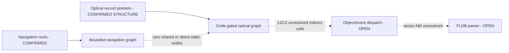

# Session 015 - Bounded optical/navigation interprocedural call graph

- Date: 2026-07-22
- Objective: trace statically resolvable SH calls from the confirmed navigation
  targets and optical-service record families while preserving object-dispatch,
  sector-ABI and buffer-provenance gaps.
- Mode: read-only static analysis; no firmware execution, modification,
  extraction for publication, repacking or vehicle access.
- Status: COMPLETE for the depth-two static-call model. No direct
  navigation-to-optical edge or sector-read ABI is established.

## Safety and promotion gates

The runner verifies both registered update-disc hashes and both Session 003
principal-image hashes. Selected members exist only in a temporary operating-
system directory and are removed after the run.

An optical record pointer is not treated as code unless both releases pass a
bounded SH gate combining decoded-instruction ratio with a prologue, return or
statically resolved call. No function boundary is asserted.

An interprocedural edge is emitted only when:

1. the call is a direct `BSR`, or its register target traces to an in-image
   PC-relative literal;
2. the same call ordinal exists in the paired release;
3. the `r4`-`r7` origin classes and local result-use signature agree;
4. both targets remain inside their registered principal images.

Object/vtable dispatch remains unresolved. Proximity, a plausible pointer and
a decoder score cannot replace a resolved target.

## Method

1. Load the two shape-equal Session 010 navigation target pairs.
2. Read aligned in-image pointers from the nine registered optical-service
   neighborhoods in both releases.
3. Pair pointer slots by anchor identity and relative record position.
4. Deduplicate identical target pairs while preserving anchor provenance.
5. Apply the two-release bounded-code gate.
6. Decode up to the first explicit SH return or the `0x180`-byte ceiling.
7. Resolve direct calls and register calls backed by PC-relative in-image
   literals.
8. Trace `r4`-`r7`, accounting for the delayed instruction at each call.
9. Track local `r0` tests, captures, dereferences and forwarding to later calls.
10. Expand same-signature resolved target pairs to depth two, with a hard
    ceiling of 128 node pairs.
11. Test graph convergence, `2048` argument use and return-value provenance.

## Confirmed findings

### S015-01 - Optical record pointers provide a reproducible seed census

| Item | Count |
|---|---:|
| Paired optical pointer slots | 102 |
| Unique optical pointer target pairs | 69 |
| Pairs passing the two-release bounded-code gate | 25 |
| Rejected weak/non-code pairs | 44 |
| Unique shape-equal navigation target pairs | 2 |
| Rejected shape-unequal Session 010 target occurrences | 3 |

The 25 accepted pairs are confirmed only as record-pointer-paired bounded code.
They are not named functions, class methods or sector readers.

Status: `CONFIRMED_RECORD_POINTER_PAIRED_BOUNDED_CODE_CENSUS`.

### S015-02 - The depth-two graph is reproducible and bounded

The graph contains:

- 35 cross-version node pairs;
- 20 deduplicated static-call edge pairs;
- 4 navigation node pairs: two roots and two depth-one nodes;
- 31 optical node pairs: 25 roots and six depth-one nodes;
- no promoted depth-two node after the complete code and signature gates.

Only three node pairs have an identical normalized window shape. Other nodes
are retained because their paired record slots and independently validated code
gates are stable; window-shape inequality prevents stronger equivalence claims.

Status: `CONFIRMED_BOUNDED_INTERPROCEDURAL_GRAPH`.

### S015-03 - The tested graphs do not converge

The navigation and optical graphs share zero node pairs. No resolved navigation
edge lands on an accepted optical root or reachable optical node.

This is a bounded negative under the accepted roots, maximum depth and static
target resolver. It does not exclude an edge hidden behind object dispatch,
message queues, callbacks or deeper call chains.

Status: `NO_DIRECT_EDGE_UNDER_TESTED_STATIC_CALL_MODEL`.

### S015-04 - No sector-read ABI candidate passes the gate

Across the 20 paired edges, the only equal immediate argument values are small
`r5` values `0`, `1`, `2` and `3`. No paired edge passes `2048` as an argument.
Three paired edges dereference a return value locally, but none forwards a
return value as an argument on both releases before the next resolved call.

These observations do not identify a sector number, byte count, destination
buffer or ownership-transfer convention.

Status: `NO_SECTOR_ABI_CANDIDATE_UNDER_TESTED_GRAPH`; sector ABI and buffer
owner remain `OPEN`.

### S015-05 - Unresolved object dispatch is the principal remaining boundary

Across accepted graph nodes, 13 CD1 and 12 CD3 indirect calls cannot be tied to
an in-image PC-relative literal. The analyzer deliberately does not turn field
loads or vtable-like pointers into targets.

This asymmetry and the absence of a cross-domain static edge make object/event
dispatch the highest-value next research boundary.

Status: `CONFIRMED_UNRESOLVED_INDIRECT_DISPATCH_BOUNDARY`.

## Operational graph v8

Graph v8 contains 32 nodes and 39 edges. It adds one
`CONFIRMED_BOUNDED_ANALYSIS` node and one `BOUNDED_NEGATIVE` edge while keeping
the parser, sector ABI and buffer owner open.

## Phoenix SDK 0.13 deliverable

Session 015 adds:

- `phoenix_mmi.optical_callgraph`;
- record-pointer seed pairing and two-release bounded-code validation;
- conservative static target resolution;
- delay-slot-aware `r4`-`r7` provenance;
- local `r0` result-use and forwarding summaries;
- depth- and node-bounded cross-version graph expansion;
- operational graph v8 correlation;
- a hash-gated Session 015 runner and three new unit tests.

## Limits

- The windows are not complete functions or control-flow graphs.
- Same ordinal and role signature are conservative pairing aids, not semantic
  function names.
- Object/vtable calls, callbacks, event queues and targets built arithmetically
  remain unresolved.
- Local return dereference does not prove that `r0` is a data buffer.
- No result establishes FLDB parsing, partition selection or compatibility with
  regenerated, newer or modified maps.

## External technical basis

- The Renesas SH-3 software manual defines delayed calls, register addressing,
  direct branches and PC-relative literal loads used by the analyzer.
- The ABI guidance already registered in Session 013 is used only to interpret
  `r4`-`r7` as candidate argument registers, never as artifact evidence.

All firmware claims come from registered local artifacts and reproducible
Project Phoenix reports.

## Next step

Recommended Session 016: decode the unresolved indirect-call sites as bounded
object-dispatch expressions. Track object origin, field displacement and the
record/vtable pointer pair that supplies each target. Promote an edge only when
the same field path and target family agree in both releases. The immediate
goal is to close the event/callback gap before attempting any sector-buffer
semantics.
