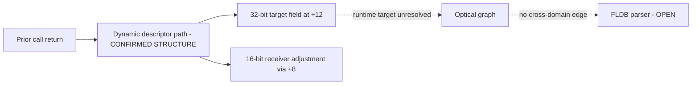

# Session 016 - Predecessor context and object-dispatch structure

- Date: 2026-07-22
- Objective: revisit the unresolved indirect calls from Session 015 with a
  bounded predecessor window and a symbolic object/descriptor path model.
- Mode: read-only static analysis; no firmware execution, modification,
  resource publication, repacking or vehicle access.
- Status: COMPLETE for the registered Session 015 nodes and the linear
  `0x100`-byte predecessor model. Two contextual literal target pairs and one
  repeated dynamic descriptor shape are confirmed structurally. No
  navigation-to-optical edge, sector ABI or buffer owner is established.

## Safety and promotion gates

The runner verifies the registered update-disc hashes and the Session 003
principal-image hashes. Firmware members are extracted only to an operating-
system temporary directory and removed after analysis.

Session 016 does not alter the Session 015 graph. It performs a second pass
only over call-site pairs that were unresolved on both releases at the same
ordinal. Duplicate call-site pairs caused by overlapping roots are collapsed.

The predecessor context is bounded to `0x100` bytes. Its start is the latest
supported save-PR prologue, the position after the latest return delay slot, or
the hard backward limit. These are analysis boundaries, not asserted function
boundaries. The trace is linear and does not claim path dominance.

A contextual literal target and a graph-expandable code node are separate:

- a traced in-image literal feeding `JSR @Rn` confirms a call target;
- graph expansion additionally requires the target window to pass the existing
  two-release bounded-code gate;
- a matching dynamic memory path confirms only descriptor structure, never a
  vtable, method name or concrete runtime target.

## Method

1. Rebuild the Session 015 seeds and depth-two graph from CD1 and CD3.
2. Select same-ordinal call pairs unresolved on both releases.
3. Deduplicate overlapping call-site pairs.
4. Add at most `0x100` bytes of predecessor context per original seed.
5. Trace the `JSR` target register through documented moves, additions,
   PC-relative literals and 8/16/32-bit memory loads.
6. Preserve `r0` as `CALL_RETURN`; treat caller-saved registers as clobbered.
7. Build a normalized target path and delay-slot-aware `r4`-`r7` paths.
8. Resolve only fully static in-image expressions.
9. Apply the existing bounded-code gate independently to each recovered target.
10. Compare descriptor field paths, receiver adjustment and selector constants
    across both releases.
11. Retest graph convergence and keep parser, sector and buffer claims open
    unless independent evidence converges.

## Confirmed findings

### S016-01 - The paired unresolved census collapses to four call sites

Session 015 counted 13 CD1 and 12 CD3 unresolved indirect calls across all
accepted graph nodes. Same-ordinal pairing on both releases followed by
call-site deduplication yields four unique pairs:

| Class after predecessor analysis | Pair count |
|---|---:|
| Contextual in-image literal call target | 2 |
| Matching dynamic descriptor structure | 2 |
| Remaining unsupported expression | 0 |

This does not resolve one-sided or differently ordered indirect calls outside
the pairing model.

Status: `CONFIRMED_BOUNDED_PREDECESSOR_CENSUS`.

### S016-02 - Two optical targets were loaded before their registered seeds

Two optical call-site pairs trace to in-image PC-relative literals in both
releases once predecessor context is included. Both pairs are new relative to
the Session 015 node set.

Neither target pair is graph-expandable under the existing code gate:

- the first pair has fully decoded windows and one return, but no accepted
  prologue or resolved child call;
- the second pair has unequal, sub-threshold or weak bounded windows and no
  accepted return/prologue combination.

They are therefore confirmed as literal-backed `JSR` targets, not asserted
function boundaries or new graph nodes.

Status: `CONFIRMED_PAIRED_CONTEXTUAL_LITERAL_CALL_TARGET`; expansion status
`REJECTED_BY_EXISTING_CODE_GATE`.

### S016-03 - Two navigation calls share one dynamic descriptor shape

The two navigation call-site pairs have one identical cross-version shape.
The target path is structurally:

```text
prior call return
  -> 32-bit load at +0
  -> 32-bit load at +0
  -> 32-bit target load at +12
  -> JSR
```

The receiver path independently performs a 16-bit load through a descriptor
address adjusted by the constant `8`, then adjusts the receiver before the
call. The delayed call slot supplies `r5 = 3` in both releases and at both call
sites.

This is strong evidence for a repeated dynamic dispatch descriptor contract.
It is not sufficient to name the structure a C++ vtable, identify a method, or
resolve the runtime target.

Status: `CONFIRMED_CROSS_VERSION_DYNAMIC_DESCRIPTOR_STRUCTURE`; semantics
`STRUCTURAL_ONLY`.

### S016-04 - The cross-domain and sector boundaries remain open

No recovered navigation target lands on an optical node. The two contextual
literal targets are optical-side only and fail the graph-expansion gate. The
dynamic descriptor target remains runtime-derived from a prior call return.

No `2048` argument, buffer provenance, ownership transfer, FLDB field access or
partition consumer is established. The repeated `r5 = 3` value is a selector
candidate only; it is not a sector count or format identifier.

Status: `NO_CROSS_DOMAIN_EDGE_UNDER_CONTEXT_MODEL`; sector ABI, buffer owner
and FLDB parser remain `OPEN`.

## Operational graph v9

Graph v9 contains 33 nodes and 40 edges. It adds one
`CONFIRMED_BOUNDED_ANALYSIS` node and one `BOUNDED_NEGATIVE` edge while
preserving every open parser, sector, buffer and compatibility boundary.



## Phoenix SDK 0.14 deliverable

Session 016 adds:

- `phoenix_mmi.object_dispatch`;
- bounded predecessor-context recovery;
- symbolic register, load and addition expressions;
- explicit call-return versus caller-saved provenance;
- static-expression resolution without dynamic target guessing;
- normalized descriptor and receiver paths;
- independent target code-gate reporting;
- operational graph v9 correlation;
- a hash-gated Session 016 runner and three new unit tests.

## Limits

- The predecessor trace is linear and does not prove branch dominance.
- Only calls already present in registered Session 015 nodes are considered.
- Calls must remain same-ordinal and unresolved on both releases to enter this
  comparison.
- A literal-backed call target is not automatically a function boundary.
- A matching field path is not automatically a vtable or method table.
- Callback registration, queues, computed indices and object initialization
  outside the bounded context remain unresolved.
- No result establishes map compatibility or authorizes firmware modification.

## Next step

Recommended Session 017: trace the producer call whose return feeds the
dynamic descriptor. Pair its static callee where possible, locate cross-version
writes that initialize the `+8` receiver-adjustment and `+12` target fields,
and test whether the same descriptor family appears in the optical-service
record graph. Promotion still requires identical field lineage and a
code-gated target family in both releases.
