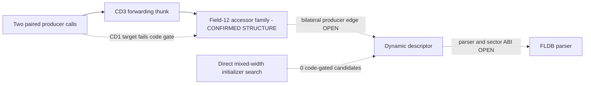

# Session 017 - Descriptor producer and field lineage

- Date: 2026-07-22
- Objective: trace the call whose return feeds the Session 016 dynamic
  descriptor, test the `+12` accessor family across CD1/CD3, and search for
  code-gated initializers of the `+8` and `+12` fields.
- Mode: read-only static analysis; no firmware execution, modification,
  resource publication, repacking or vehicle access.
- Status: COMPLETE for the registered Session 016 dispatch sites, exact
  field-12 accessor shape, aligned static-record model and mixed-width
  initializer model. The CD3 producer-to-accessor chain is confirmed locally;
  the bilateral producer edge and initializer remain open.

## Safety and promotion gates

The runner verifies the registered update-disc hashes and the Session 003
principal-image hashes. It extracts only the two selected principal-image
members to an operating-system temporary directory and deletes them after the
run.

Session 017 makes four evidence classes deliberately independent:

- a nearest preceding call with a literal-backed target;
- a bounded target window passing the existing code gate;
- an exact field-12 accessor shape;
- a mixed-width same-base initializer passing a separate executable-context
  gate.

A match in one class does not promote another. File-relative offsets and
aggregate counts may be published, but firmware bytes, instruction bytes, raw
strings, local paths and extracted resources may not.

## Method

1. Rebuild the two registered dynamic dispatch pairs from Session 016.
2. Within the same bounded predecessor context, select the nearest preceding
   call whose return reaches the descriptor path.
3. Trace its target and delay-slot-aware `r4`-`r7` arguments.
4. Summarize the target and its single statically resolved child with the
   Session 015 code gate.
5. Search both images for the exact eight-instruction accessor that returns a
   32-bit field at displacement `12`.
6. Cluster accessor occurrences by a maximum `0x1000` gap and pair clusters
   only when count and complete gap vector agree.
7. Census aligned static records with a signed 16-bit `+8` value and an
   in-image 32-bit `+12` pointer; correlate targets only through accepted
   Session 015 optical node pairs.
8. Search for `MOV.W R0,@(disp,Rn)` at `+8` and `MOV.L Rm,@(disp,Rn)` at `+12`
   on the same base within `0x100` bytes.
9. Require an independently acceptable bounded-code context before labeling a
   mixed-width pair an initializer.
10. Preserve parser, sector ABI, buffer provenance, buffer owner and partition
    consumer as open unless a bilateral field lineage closes them.

The trace is linear. Context boundaries are not asserted function boundaries,
and branch/path dominance is not claimed.

## Confirmed findings

### S017-01 - Both dispatch sites have paired producer calls

The nearest preceding call is 26 bytes before each dynamic dispatch in both
releases. Both call-site pairs preserve the same argument roles:

| Dispatch instance | `r4` producer argument | `r5` | `r6` / `r7` |
|---|---|---:|---|
| first | `ENTRY:r4 + 8` | `0` | caller-saved / unresolved |
| second | `ENTRY:r4 + 36` | `0` | caller-saved / unresolved |

Each release reuses one producer target for both instances. This confirms two
paired literal-backed producer call sites and one unique target pair.

Status: `CONFIRMED_PAIRED_LITERAL_PRODUCER_CALL_SITES`.

### S017-02 - Producer target evidence is asymmetric

The CD3 target is a fully decoded seven-instruction forwarding thunk. Its one
resolved child returns `LOAD32[12](ENTRY:r4)`, so the CD3 chain is:

```text
producer call
  -> forwarding target
  -> field-12 accessor
  -> CALL_RETURN used by Session 016 descriptor dispatch
```

The corresponding CD1 target has a low decoded-instruction ratio and fails the
bounded code gate. Its resolved child returns a constant under the tested
linear model. Producer target shapes therefore differ, and zero target pairs
are promoted cross-version.

Status: `CONFIRMED_SINGLE_RELEASE_FIELD12_ACCESSOR_CHAIN` for CD3;
cross-version producer target `NOT_PROMOTED`.

### S017-03 - A paired field-12 accessor family exists

The exact accessor semantic shape occurs 12 times in CD1 and 12 times in CD3.
One non-singleton cluster pair has six members and an identical complete gap
vector. The CD3 producer child is the last member of this paired cluster.

The corresponding CD1 cluster member has no direct runtime-word reference
under the exact address model, while the CD3 member has many. This confirms the
cross-version accessor family, but not the missing CD1 producer edge.

Status: `CONFIRMED_CROSS_VERSION_ACCESSOR_CLUSTER`; owner and method semantics
remain `OPEN`.

### S017-04 - Static descriptor grammar is broad, not lineage proof

The deliberately permissive aligned-record census produced 109,043 CD1 and
92,326 CD3 raw candidates. Restricting the `+12` pointer to accepted optical
nodes leaves 96 and 318 candidates respectively. Of 31 accepted optical target
pairs:

- 20 have at least one equal adjustment/field-role signature;
- 27 matching signatures exist in total;
- zero matching signatures have descriptor bases directly referenced in both
  releases.

The result shows that the layout grammar occurs near optical targets. Its
false-positive surface is too large to label any candidate as the Session 016
descriptor.

Status: `CONFIRMED_BOUNDED_STATIC_LAYOUT_CENSUS`; descriptor identity
`NOT_ASSERTED`.

### S017-05 - No initializer passed the executable-context gate

The mixed-width scan found 20 same-base raw `+8`/`+12` pairs in each image; 18
per image were analyzable, and 18 cross-version symbolic signatures paired.
Zero candidates passed the bounded executable-context gate in either release.

This is a bounded negative result for direct nearby `MOV.W`/`MOV.L`
initialization. It does not exclude constructors using copied templates,
helper calls, computed stores, aliases, different base registers, DMA or
runtime-loaded data.

Status: `NOT_FOUND_UNDER_CODE_GATED_MIXED_WIDTH_MODEL`.

## Operational graph v10

Graph v10 contains 34 nodes and 41 edges. It adds one
`CONFIRMED_BOUNDED_ANALYSIS` node and one `BOUNDED_NEGATIVE` edge. All sector,
buffer, parser, partition and compatibility boundaries remain open.



## Phoenix SDK 0.15 deliverable

Session 017 adds:

- `phoenix_mmi.descriptor_lineage`;
- nearest-producer and single-child return-path tracing;
- exact field-12 accessor-family clustering;
- optical-target-aware static descriptor census;
- mixed-width `+8`/`+12` initializer search with an executable-context gate;
- SH-3 displaced `MOV.W` store/load decoding required by the search;
- operational graph v10 correlation;
- a hash-gated Session 017 runner and four new unit tests.

The complete test suite now contains 60 passing tests.

## Limits

- The nearest preceding call is not proven to dominate every path.
- Target summaries are bounded windows, not declared function boundaries.
- Exact accessor shape does not establish class, vtable, method or owner
  semantics.
- Static-record candidates are intentionally broad and remain anonymous.
- Direct runtime-word references do not cover relocation tables, encoded
  pointers or computed addresses.
- The initializer search covers only nearby direct mixed-width stores through
  a common base.
- No result establishes map compatibility or authorizes firmware modification.

## Next step

Recommended Session 018: analyze the repeated accessor family as a complete
cross-version call/reference neighborhood. Recover callers through PC-relative
literal pools and indirect registration records, then test event/callback
tables for a bilateral edge into the optical-service graph. Keep producer
identity and media semantics open until both releases converge through the
same code-gated chain.
