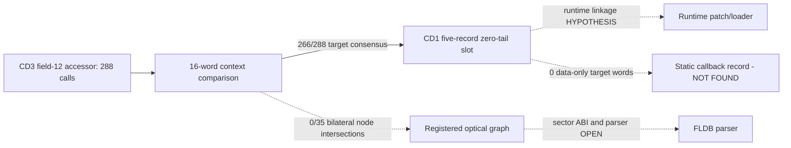

# Session 018 - Accessor call family and runtime-linkage slot

- Date: 2026-07-22
- Objective: map all static references to the Session 017 field-12 accessor,
  pair its call-site neighborhoods across CD1/CD3, test direct callback/event
  registration records and intersect the result with the accepted Session 015
  optical graph.
- Mode: read-only static analysis; no firmware execution, modification,
  resource publication, repacking or vehicle access.
- Status: COMPLETE for the exact accessor target, adjacent PC-relative
  `MOV.L`/`JSR` form, 16-word normalized context, direct target-word record
  model and the 35 registered graph-node pairs. A cross-version call family
  converges on one structural CD1 slot; runtime patching, callbacks and an
  optical edge remain unconfirmed.

## Safety and promotion gates

The runner verifies the registered update-disc hashes and Session 003
principal-image hashes. It extracts only the two selected members to an
operating-system temporary directory and removes them after analysis.

Five evidence classes remain independent:

- an exact target word in the image;
- a PC-relative load of that word;
- an immediately adjacent `JSR` through the same register;
- a cross-version normalized call-site context;
- a zero-tail pointer record containing the selected CD1 target.

The raw literal/JSR census is intentionally broad and receives no code
semantics. A call-family promotion requires at least 32 unique 16-word context
matches and at least 90% dominant-target consensus. Even after promotion,
runtime equivalence and callback/trampoline semantics remain unasserted.

## Method

1. Recompute the exact six-member accessor cluster registered by Session 017.
2. Select its linked ordinal in both releases.
3. Enumerate exact target words, PC-relative loads and adjacent same-register
   `JSR` forms.
4. Build raw adjacent literal/JSR censuses without labeling every occurrence
   as executable code.
5. Normalize eight words before and six words after each load, masking only
   PC-relative and branch displacements.
6. Index CD1 candidates by the resulting 16-word signature.
7. For each known CD3 accessor call, measure unique, ambiguous, unmatched and
   single-target-consensus CD1 contexts.
8. Promote a call family only when the fixed consensus and uniqueness gates
   pass.
9. Parse any dominant CD1 target as a zero-tail record run without decoding it
   as static code.
10. Count target words that are not used as PC-relative literals. Only such
    data-only words may seed the direct registration-record model.
11. Decode the registered Session 015 node windows and test whether a matched
    call occurs inside the same paired node in both releases.
12. Preserve producer, callback, optical, parser, buffer and sector semantics
    as open unless these independent paths converge.

## Confirmed findings

### S018-01 - CD3 has a large direct accessor-call family

The linked CD3 accessor target occurs as 288 aligned words. All 288 words are
used as PC-relative literal-pool entries. They receive 290 PC-relative loads,
and 288 loads are immediately followed by `JSR` through the same register.

The structurally paired CD1 accessor has zero exact target words, zero
PC-relative loads and zero adjacent calls. The Session 017 cluster pairing is
therefore real, but this particular CD1 member is not the static call target
under the tested model.

Status: `CONFIRMED_LITERAL_BACKED_ACCESSOR_CALL_FAMILY` for CD3;
cross-version accessor structure remains confirmed independently.

### S018-02 - Strong CD3 contexts converge on one CD1 target

The fixed 16-word context comparison produced:

| Result | CD3 call count |
|---|---:|
| Unique CD1 context | 179 |
| Ambiguous CD1 context | 101 |
| Unmatched | 8 |
| Every CD1 candidate agrees on one target | 266 |
| Ambiguous contexts containing multiple targets | 14 |

All 266 consensus contexts select the same CD1 target. Coverage is
`266 / 288 = 92.3611%`, above the fixed 90% gate, and the 179 unique matches
are above the minimum of 32.

The dominant CD1 target occurs in 286 literal pools, receives 287 PC-relative
loads and is used by 286 adjacent same-register calls. All its aligned
occurrences are code-referenced literal entries.

Status: `CONFIRMED_BOUNDED_TARGET_CONVERGENCE`. This confirms a call-family
change, not equal runtime behavior or an identical function.

### S018-03 - The dominant CD1 target lies inside a zero-tail record run

The dominant CD1 target is eight bytes into the second member of one unique
five-record run. Every record is 16 bytes:

```text
+0x00  in-image pointer (4 bytes)
+0x04  zero tail (12 bytes)
```

The target has eight zero bytes remaining before the next record. All five
pointer fields resolve in the image, and their target-delta vector is:

```text
-576, -576, -576, -576
```

This is a confirmed structural slot/run. It is not decoded as static code.
Runtime-generated linkage, patch slot or trampoline behavior is a
`HYPOTHESIS` until a writer/loader or runtime observation is found.

Status: `CONFIRMED_ZERO_TAIL_RUNTIME_POINTER_RECORD_RUN`; semantics
`HYPOTHESIS`.

### S018-04 - Direct callback records were not found

Across the paired CD1 accessor, the CD3 accessor and the dominant CD1 slot,
zero aligned target words remain as data-only occurrences. Every existing word
is consumed as a PC-relative literal.

Consequently the direct target-word registration model yields zero static
callback-record candidates. This does not exclude encoded pointers, copied
tables, loader-created registrations, queues or runtime-only callbacks.

Status: `NOT_FOUND_UNDER_DIRECT_TARGET_WORD_MODEL`.

### S018-05 - The accepted optical graph does not contain this call family

The Session 015 graph has 35 registered cross-version node pairs. None of the
288 CD3 accessor calls occurs inside a registered right-side node window, and
zero calls intersect the same paired node bilaterally.

No navigation-to-optical edge is promoted. This negative result is bounded to
the registered seeds and node windows; it does not cover unregistered event
dispatch, runtime callbacks or deeper graph expansion.

Status: `NOT_FOUND_UNDER_REGISTERED_NODE_MODEL`.

## Operational graph v11

Graph v11 contains 35 nodes and 42 edges. It adds one
`CONFIRMED_BOUNDED_ANALYSIS` node and one `BOUNDED_NEGATIVE` edge.



## Phoenix SDK 0.16 deliverable

Session 018 adds:

- `phoenix_mmi.accessor_dispatch`;
- adjacent PC-relative `MOV.L`/same-register `JSR` census;
- target reference profiles separating literal pools from data-only words;
- fixed 16-word cross-version context normalization and consensus gates;
- structural zero-tail runtime-pointer record-run detection;
- direct callback-record and registered graph-intersection gates;
- operational graph v11 correlation;
- a hash-gated Session 018 runner and four new unit tests.

The complete suite contains 64 passing tests.

## Limits

- Raw adjacent literal/JSR candidates include data false positives until a
  known target and cross-version context gate are applied.
- Context equality does not prove a one-to-one call-site pairing when a
  signature is ambiguous.
- Target convergence does not prove equal runtime return values or ABI.
- The zero-tail slot may be patched, copied, interpreted or unused; no writer
  or runtime state is yet known.
- The direct registration model cannot see encoded or runtime-created
  callbacks.
- The graph intersection covers only the 35 Session 015 paired nodes.
- No result establishes map compatibility or authorizes firmware modification.

## Next step

Recommended Session 019: locate cross-version code or relocation records that
write to, copy from or initialize the five-record CD1 zero-tail run. Trace the
five pointer fields and the `-576` family as bounded sources, then determine
whether the selected `+8` slot is runtime-generated linkage, an overlay entry
or another indirection format. A runtime-linkage label still requires a
specific writer/loader chain.
