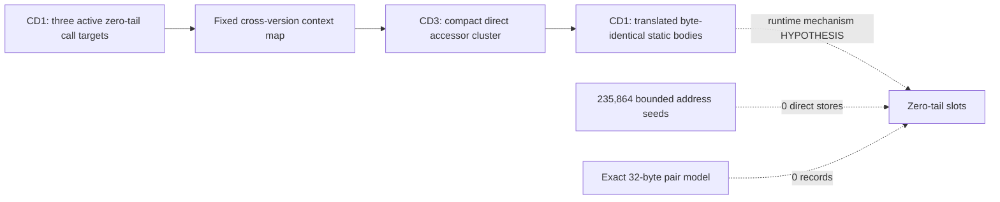

# Session 019 - Runtime-slot lineage and shadow accessors

- Date: 2026-07-22
- Objective: expand the Session 018 five-record CD1 run, identify every active
  zero-tail call target, correlate those targets with direct CD3 code, trace
  the five pointer fields and search bounded writer/relocation models.
- Mode: read-only static analysis; no firmware execution, modification,
  extraction publication, repacking or vehicle access.
- Status: COMPLETE for the 15-word tail census, fixed call-context mapping,
  translated byte-identical body test, 64-instruction direct-writer model and
  exact 32-byte source/destination record model. A shadow layout is confirmed;
  the runtime mechanism remains open.

## Safety and promotion gates

The runner verifies the registered update-disc hashes and Session 003
principal-image hashes. Principal members exist only in an operating-system
temporary directory and are removed after analysis.

Session 019 keeps four evidence classes separate:

- literal-backed calls to a zero-filled on-disk slot;
- normalized cross-version call contexts;
- byte-identical static bodies at translated offsets;
- a static instruction path that writes to the run.

Only the first three were found. A possible branch encoding is tested only as
arithmetic feasibility. No zero-filled word is decoded as existing code and no
runtime mechanism is promoted without a writer/loader chain.

## Method

1. Reparse the unique five-record run registered by Session 018.
2. Treat each of its 15 zero-tail words as an independent target candidate.
3. Count exact runtime words, PC-relative references and adjacent
   same-register calls.
4. Map each active CD1 call family into CD3 using the unchanged 16-word
   normalized context.
5. Reapply the Session 018 reverse 90%/32-unique promotion gate.
6. Translate selected CD3 entries back to the static CD1 accessor cluster
   using the confirmed Session 017 anchor.
7. Compare complete bounded bodies without publishing their bytes.
8. Test whether a signed 12-bit branch plus delay slot could fit between each
   active slot and its translated static body.
9. Trace PC-relative runtime/raw/flash and `MOVA` address seeds forward through
   register copies and constant arithmetic to direct stores.
10. Test exact pointer-field/active-slot pairs within a 32-byte neighborhood.
11. Preserve runtime, optical, parser, sector and buffer semantics as open.

## Confirmed findings

### S019-01 - Three zero-tail words are call targets

Of 15 zero-tail words, exactly three have adjacent literal-backed call forms;
the other 12 have none.

| Record / word | Exact target words | PC-relative loads | Adjacent calls |
|---|---:|---:|---:|
| 1 / 1 | 286 | 287 | 286 |
| 2 / 0 | 302 | 303 | 286 |
| 4 / 1 | 209 | 341 | 337 |

Status: `CONFIRMED_THREE_LITERAL_BACKED_CALL_TARGETS`.

### S019-02 - A translated static accessor cluster remains in CD1

The three active CD1 families select three compact CD3 direct entries. Using
the Session 017 accessor as a fixed translation anchor, all three corresponding
CD1 locations contain byte-identical bodies. Their bounded widths are 16, 22
and 40 bytes; those exact bodies occur 12, three and 12 times in CD1.

All three translated CD1 targets have zero direct adjacent literal calls. The
relative member offsets inside the CD1 and CD3 clusters are equal.

Status: `CONFIRMED_THREE_BYTE_IDENTICAL_MEMBERS` for body identity and cluster
layout. This does not make every slot mapping equally strong.

### S019-03 - Mapping confidence differs by member

| Member | CD3 calls | Dominant CD1 consensus | Classification |
|---|---:|---:|---|
| 0 | 288 | 266 (92.3611%) | `CONFIRMED_BOUNDED_SLOT_TO_DIRECT_MEMBER` |
| 1 | 305 | 8 (2.6230%) | `CANDIDATE_STRUCTURAL_SHADOW_MEMBER` |
| 2 | 342 | 302 (88.3041%) | `PROBABLE_HIGH_CONSENSUS_SHADOW_MEMBER` |

Member 0 passes the unchanged Session 018 promotion gate. Member 2 is strong
but remains below 90% and has 31 rather than 32 unique contexts. Member 1 is
retained only as a structural candidate despite its exact translated body.

### S019-04 - Slot-to-body deltas are regular and branch-feasible

The three file-relative slot-to-static-body deltas are:

```text
-368, -360, -352
```

For each member, a signed 12-bit SuperH branch could reach the body and a
four-byte branch-plus-delay-slot footprint fits before the record end. The
on-disk words remain zero and no encoding or writer was observed.

Status: `CONFIRMED_ARITHMETIC_FEASIBILITY`; branch veneer/trampoline semantics
remain a hypothesis.

### S019-05 - The five pointer fields do not establish writers

Their target delta vector remains four repetitions of `-576`. Three of five
targets pass the bounded code gate, but only the first target has a separate
adjacent literal call; the other four occur only in the record table under the
direct target-word model. The five code shapes differ, and no writer role is
promoted.

Status: pointer grammar `CONFIRMED`; source/writer roles `OPEN`.

### S019-06 - No direct static writer or exact relocation pair was found

The bounded writer pass evaluated 235,864 syntactic address seeds:

| Address model | Seeds |
|---|---:|
| Runtime base | 215,247 |
| Raw file offset | 10,540 |
| METAINFO flash base | 6,152 |
| `MOVA` file relative | 3,925 |

No traced direct/displaced/pre-decrement store resolves inside the run. The
exact 32-byte source-pointer/active-slot pair model also returns zero records.

Status: `NOT_FOUND_UNDER_BOUNDED_PC_RELATIVE_ADDRESS_MODEL` and
`NOT_FOUND_UNDER_EXACT_32_BYTE_PAIR_MODEL`.

The negative result does not cover GBR addressing, bases loaded from memory,
helper-mediated copies, section-relative relocation records, compressed loader
metadata or runtime-only behavior.

## Operational graph v12

Graph v12 contains 36 nodes and 43 edges. It adds one
`CONFIRMED_BOUNDED_ANALYSIS` node and one `CONFIRMED_STRUCTURAL` edge.



The confirmed graph edge describes a static cross-version layout relation,
not observed runtime control flow.

## Phoenix SDK 0.17 deliverable

Session 019 adds:

- `phoenix_mmi.runtime_slot`;
- complete 15-word tail-slot census;
- left-to-right and right-to-left fixed-context member mapping;
- translated byte-identical body and static-reference profiles;
- bounded branch-feasibility reporting without publishing instruction bytes;
- a global PC-relative/raw/flash/`MOVA` direct-writer search;
- an exact source/destination proximity-record search;
- operational graph v12 correlation;
- a hash-gated Session 019 runner and five new unit tests.

The complete suite contains 69 passing tests.

## Limits

- Raw PC-relative candidates include non-code data until later gates apply.
- Only member 0 passes the unchanged strong call-family gate.
- Exact body identity does not establish runtime routing to that body.
- The writer tracer is linear, instruction-bounded and does not model GBR,
  memory-loaded bases, branch dominance or helper-mediated copying.
- The exact record model cannot see encoded or section-relative relocation
  formats.
- No result establishes a map parser, sector ABI, buffer provenance, map
  compatibility or authorization to modify firmware.

## Next step

Recommended Session 020: move outward from the shadow cluster rather than
tuning context thresholds. Identify the loader/startup owner of the CD1 region
by tracing section-copy tables, cache-maintenance calls and memory-loaded/GBR
base writers. A runtime-linkage label still requires one concrete chain from a
loader or initializer to at least one active slot.
