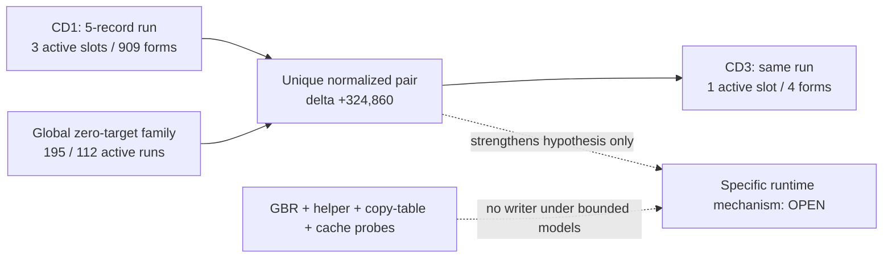

# Session 020 - Bilateral runtime-linkage family and loader probes

- Date: 2026-07-23
- Objective: determine whether the Session 019 five-record layout survives in
  CD3, measure its use in both releases, place it in the global zero-target
  family and test bounded GBR, helper, section-copy and cache-maintenance
  loader models.
- Mode: read-only static analysis; no firmware execution, modification,
  extracted-resource publication, repacking or vehicle access.
- Status: COMPLETE for normalized run pairing, the global syntactic census and
  the four declared writer models. The bilateral layout is confirmed; its
  runtime initializer and semantics remain open.

## Safety and promotion gates

The runner verifies the registered CD1/CD3 ISO hashes and the Session 003
principal-image hashes. Selected members exist only in an operating-system
temporary directory and are removed after analysis.

Session 020 maintains four independent evidence classes:

- a pointer followed by 12 zero on-disk bytes;
- an adjacent PC-relative `MOV.L` / same-register `JSR` form selecting a zero
  word;
- a normalized cross-version record geometry;
- a bounded path that writes to the record.

Zero-filled targets are never decoded as code. The global call census is
syntactic and does not assert that every scanned halfword is executable. A
runtime mechanism still requires a concrete loader/writer chain or controlled
runtime evidence.

## Method

1. Enumerate every four-byte-aligned `in-image pointer + 12 zero bytes` record.
2. Join consecutive 16-byte records into runs.
3. Re-identify the Session 019 CD1 run from its registered start.
4. Search CD3 for the same record count, pointer delta vector and
   first-pointer-to-run relationship.
5. Require a unique candidate and compare the run-start and all pointer-target
   translations.
6. Count adjacent literal/indirect-call forms for all 15 tail words in both
   selected runs.
7. Build a global census of zero-filled literal targets and active
   pointer-zero runs without assigning code semantics.
8. Resolve local PC-relative or `MOVA` bases for bounded `ldc rN,gbr`
   initializers and scan up to 512 bytes for GBR stores into the selected run.
9. Trace exact run addresses for at most 64 instructions and accept a helper
   candidate only when the address reaches `r4`-`r7` at an indirect call
   through another register.
10. Parse aligned `source, destination, length` triples with in-image ranges,
    a maximum one-MiB length, at least two consecutive records, one address
    model pair shared by the whole table and a PC-relative reference to its
    start.
11. Test five exact cache-maintenance API markers without publishing their
    text in generated reports.
12. Preserve memory-loaded bases, external loaders, branch dominance and
    runtime-created metadata as open.

## Confirmed findings

### S020-01 - The five-record run is bilateral

CD3 contains exactly one normalized match for the Session 019 run. The
translation from CD1 to CD3 is `+324,860` bytes. The run start and every one of
its five pointer targets move by that same amount.

The internal geometry is unchanged:

```text
records:                  5
record width:             16 bytes
first pointer from run:   +7,716 bytes
pointer-target deltas:    -576, -576, -576, -576
```

Status: `CONFIRMED_UNIQUE_NORMALIZED_BILATERAL_RUN` and
`CONFIRMED_EQUAL_RUN_AND_POINTER_TRANSLATION`.

This disproves the working assumption that the structure is CD1-only. It does
not establish why the zero words exist or what may occupy them at runtime.

### S020-02 - CD3 retains residual use of the run

| Release | Active tail slots | Adjacent literal/JSR forms |
|---|---:|---:|
| CD1 | 3 of 15 | 909 |
| CD3 | 1 of 15 | 4 |

The retained CD3 target is record 2, tail word 0. The corresponding CD1 word is
also one of its three active targets.

Status: `CONFIRMED_SYNTACTIC_3_TO_1_ACTIVE_SLOTS`.

Most call-family use moves away from the selected CD3 run, but the structure
and one residual call target remain. This supports a shared framework with a
release-dependent usage policy more strongly than a one-release compatibility
patch. Runtime behavior is not observed.

### S020-03 - Zero-filled literal targets are a broad image family

| Metric | CD1 | CD3 |
|---|---:|---:|
| Adjacent literal/JSR forms | 110,614 | 106,093 |
| Unique literal targets | 20,870 | 20,605 |
| Zero-filled target words | 751 | 606 |
| Calls to zero-filled targets | 3,136 | 1,744 |
| Pointer-zero runs | 7,107 | 3,896 |
| Active pointer-zero runs | 195 | 112 |
| Zero targets covered by such runs | 199 | 112 |
| Zero targets outside such runs | 552 | 494 |

The selected CD1 run is the largest active run by call count: 909. The largest
CD3 active run has 33 forms; the selected CD3 run has four.

Status: `CONFIRMED_SYNTACTIC_FAMILY`.

This establishes prevalence under one exact scanner, not a global runtime-link
table. Data decoded as instructions remains possible in the broad census.

### S020-04 - No bounded resolved-GBR writer was found

| Metric | CD1 | CD3 |
|---|---:|---:|
| Syntactic GBR initializers | 229 | 218 |
| Register-form initializers | 56 | 54 |
| Memory-load initializers | 173 | 164 |
| Locally resolved register initializers | 2 | 2 |
| Resolved address facts | 4 | 4 |
| Stores into selected run | 0 | 0 |

Status: `NOT_FOUND_UNDER_BOUNDED_RESOLVED_GBR_MODEL`.

The model does not resolve `ldc.l @rN+,gbr`, interprocedural GBR state or
runtime-loaded global bases.

### S020-05 - No exact-address helper destination was found

The helper pass evaluated 931 CD1 and 17 CD3 exact-run address seeds. No seed
reached `r4`-`r7` at an indirect call through a different register within 64
instructions.

Status: `NOT_FOUND_UNDER_EXACT_RUN_ADDRESS_ARGUMENT_MODEL`.

Computed, section-relative and memory-loaded destinations remain outside this
model.

### S020-06 - No referenced coherent copy table covers the run

| Metric | CD1 | CD3 |
|---|---:|---:|
| Structurally valid single-record offsets | 22,918 | 22,889 |
| Coherent multi-record sequences | 1,823 | 1,819 |
| Referenced coherent sequences | 33 | 27 |
| Coherent sequences covering the run | 21 | 5 |
| Referenced coherent sequences covering the run | 0 | 0 |

The preliminary CD3 overlap disappeared when all records were required to use
one common source/destination address-model pair. This gate prevents adjacent
constants or instruction-shaped values from becoming a copy table merely
because each triple is arithmetically in range.

Status: `NOT_FOUND_UNDER_REFERENCED_UNIFORM_MODEL_TRIPLE_GATE`.

Other table grammars, encoded lengths, compressed metadata and external boot
stages remain open.

### S020-07 - Named cache-maintenance evidence is absent

Five exact API markers have zero occurrences in both images.

Status: `NOT_FOUND_UNDER_FIVE_EXACT_ASCII_MARKERS`.

This does not cover stripped symbols, ordinal imports, indirect APIs or inlined
cache-control instructions.

## Operational graph v13

Graph v13 contains 37 nodes and 44 edges. It adds one
`CONFIRMED_BOUNDED_ANALYSIS` node and one `CONFIRMED_STRUCTURAL` edge.



The graph edge describes bilateral static layout and residual syntactic use,
not observed runtime control flow.

## Phoenix SDK 0.18 deliverable

Session 020 adds:

- `phoenix_mmi.runtime_linkage`;
- normalized cross-version pointer-zero run pairing;
- per-run and global zero-filled literal-target censuses;
- bounded GBR base resolution and displaced-store scanning;
- exact-address helper-argument tracing;
- coherent referenced section-copy table gates;
- exact cache-marker census without publishing marker text;
- operational graph v13 correlation;
- a hash-gated Session 020 runner and five new unit tests.

The complete suite contains 74 passing tests.

## Limits

- The broad call census is syntactic and lacks a whole-image executable map.
- A zero-filled on-disk target is not proof of a runtime-generated function.
- The GBR model cannot resolve memory-loaded or interprocedural base state.
- The helper model requires an exact run address and a direct `r4`-`r7`
  argument path.
- The copy model accepts only consecutive `source, destination, length`
  triples with a uniform address-model pair.
- Cache operations may be stripped, indirect or inlined.
- No result establishes a map parser, optical sector ABI, buffer provenance,
  dynamic map compatibility or authorization to modify firmware.

## Next step

Recommended Session 021: identify the owner of the runtime-linkage family
before broadening writer emulation. Start from the four residual CD3 calls and
their CD1 homologues, cluster the containing bounded code entries, then compare
those owners against the other 195/112 active pointer-zero runs. A
memory-loaded/interprocedural writer model should be seeded from an identified
owner rather than applied indiscriminately to the entire image.
