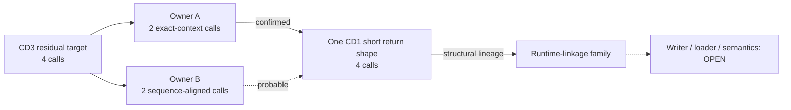

# Session 021 - Residual linkage-owner lineage

- Date: 2026-07-23
- Objective: group the four residual CD3 calls from Session 020 into bounded
  owner windows, correlate them with CD1 homologues and measure how those
  windows fit the global active pointer-zero family.
- Mode: read-only static analysis; no firmware execution, modification,
  resource extraction publication, repacking or vehicle access.
- Status: COMPLETE for the declared bounded owner and sequence-alignment
  models. Structural lineage is established; owner semantics, runtime
  initialization and the writer/loader chain remain open.

## Safety and evidence boundaries

The runner verifies the registered CD1/CD3 ISO hashes and the Session 003
principal-image hashes. Selected ISO members are extracted only into an
operating-system temporary directory and are removed after analysis.

An owner window is an analysis boundary, not a recovered function. Its start is
the latest decoded `sts.l pr,@-r15` within 256 predecessor bytes, when present,
and its end is the first return after the seed or a 384-byte ceiling. Promotion
also requires the existing bounded-code gate. Phoenix does not assert:

- a true function boundary;
- path dominance;
- semantic equivalence between releases;
- execution of a zero-filled on-disk target;
- a runtime patch, overlay, trampoline or linker;
- a writer, loader or initializer.

## Method

1. Recover the single active CD3 tail target registered by Session 020.
2. Enumerate its four adjacent PC-relative literal / same-register `JSR`
   forms.
3. Group those calls by the bounded predecessor-context owner rule.
4. Index all CD1 call sites by the existing fixed 16-word normalized context
   signature.
5. Use exact context matches to establish a candidate CD1 target.
6. Enumerate every CD1 call to that target and group those calls by the same
   owner rule.
7. Normalize complete bounded owner instruction sequences by mnemonic,
   address-independent operands, flow type and delay-slot state.
8. Compare the complete two-by-two owner matrix with `SequenceMatcher`,
   require every residual call to align to a CD1 call to the selected target
   and apply fixed similarity and uniqueness gates.
9. Independently characterize the CD1 target as a short, literal-backed,
   return-terminated shape without assigning function semantics.
10. Census the owner windows of all active pointer-zero targets in both
    releases and count exact normalized shapes only among prologue-backed,
    code-gated windows.

## Confirmed and probable findings

### S021-01 - Four CD3 calls form two bounded owners

The four residual calls group into exactly two owner windows. Both begin at the
latest detected save-PR prologue, pass the bounded-code gate, contain one
return and contain two selected calls.

| CD3 owner start | Instructions | All calls | Selected calls | Returns |
|---:|---:|---:|---:|---:|
| 2,002,746 | 121 | 10 | 2 | 1 |
| 2,012,550 | 120 | 12 | 2 | 1 |

Status:
`CONFIRMED_FOUR_CALLS_IN_TWO_PROLOGUE_CODE_GATED_OWNERS`.

The term “owner” denotes only the bounded window containing a call. It is not a
function name or subsystem identity.

### S021-02 - All four calls share one CD1 structural lineage

Two CD3 calls each have one unique fixed-context CD1 match. Both matches call
the same CD1 target at file offset `1,860,824`. A complete comparison of the
two CD1 and two CD3 owner windows then maps all four CD3 calls to the four CD1
calls targeting that same location.

| CD1 owner | CD3 owner | Similarity | Margin | Exact calls | Aligned calls | Status |
|---:|---:|---:|---:|---:|---:|---|
| 1,680,002 | 2,002,746 | 0.983471 | 0.615270 | 2 | 2 | CONFIRMED |
| 1,689,866 | 2,012,550 | 0.781513 | 0.441264 | 0 | 2 | PROBABLE |

The first pair requires complete call alignment, two exact context matches and
similarity at or above `0.95`. The second requires complete call alignment,
equal call/return counts, a unique left assignment, similarity at or above
`0.75` and a margin of at least `0.25` over its alternative.

Status:
`CONFIRMED_TWO_EXACT_PLUS_TWO_PROBABLE_SEQUENCE_ALIGNED`.

This is bounded structural lineage. The probable pair is not promoted merely
because it is the best candidate.

### S021-03 - The CD1 destination is a short return-terminated shape

The common CD1 target has:

- 4 adjacent literal/JSR call forms;
- 17 PC-relative load references;
- 14 aligned word occurrences, all used as PC-relative literals;
- 0 data-only aligned occurrences;
- a 10-byte bounded window with 5 instructions;
- known-instruction ratio `0.8`;
- one return and no calls.

Status: `CONFIRMED_LITERAL_BACKED_SHORT_RETURN_SHAPE`.

The general bounded-code gate does not pass because this compact entry has no
prologue or resolved nested call. Session 021 therefore uses a separate,
explicit short-shape gate. It confirms shape and reference mode only, not
behavior or function semantics.

### S021-04 - The selected owners sit inside a broad syntactic family

| Metric | CD1 | CD3 |
|---|---:|---:|
| Active pointer-zero targets | 199 | 112 |
| Calls to active targets | 1,567 | 319 |
| Bounded owner windows | 1,453 | 310 |
| Code-gated owners | 1,235 | 257 |
| Calls in code-gated owners | 1,349 | 266 |
| Prologue-backed code-gated owners | 1,206 | 243 |
| Calls in those owners | 1,320 | 252 |
| Exact prologue-owner shapes | 485 | 184 |

Twenty-nine exact normalized prologue-owner shapes occur in both releases,
covering 235 CD1 and 44 CD3 owner instances.

Status: `CONFIRMED_SYNTACTIC_OWNER_CENSUS`.

The global scan does not establish semantic owner classes. It can include
instruction-shaped data because a complete executable map is still unknown.

## Operational graph v14

Graph v14 contains 38 nodes and 45 edges. It adds one
`CONFIRMED_BOUNDED_ANALYSIS` node and one
`CONFIRMED_AND_PROBABLE_STRUCTURAL_LINEAGE` edge.

No graph edge represents observed runtime control flow.

## Phoenix SDK 0.19 deliverable

Session 021 adds:

- `phoenix_mmi.linkage_owner`;
- reusable in-memory bounded decoding for repeated owner analysis;
- owner grouping with explicit boundary disclaimers;
- normalized full-window sequence comparison and fixed promotion gates;
- short literal-backed return-shape characterization;
- whole-image syntactic owner censuses and cross-release shape counts;
- operational graph v14 correlation;
- a hash-gated Session 021 runner and five new unit tests.

The complete suite contains 79 passing tests.

## Determinism and publication safety

Two complete ISO-to-report runs produced byte-identical SHA-256 values for all
four public reports. Generated evidence contains hashes, file-relative offsets,
aggregate counts, fixed thresholds and classifications. It contains no
firmware bytes, instruction bytes, absolute runtime addresses, raw strings,
local paths, map payloads or extracted resources.

## Limits

- Bounded owner starts are analysis anchors, not recovered function starts.
- Sequence similarity does not prove semantic equivalence.
- The second owner pair remains probable.
- The short CD1 target is structurally characterized but not executed.
- The broad census is syntactic and lacks a complete executable map.
- No memory-loaded or interprocedural state base is resolved.
- No writer, loader, producer edge, parser, optical sector ABI, buffer owner,
  buffer provenance or dynamic map compatibility is established.

## Next step

Recommended Session 022: build a bounded incoming-caller and state-base
provenance graph for the two owner pairs. Follow direct callers and stable
literal/data references only inside aligned owner/caller envelopes, then test
memory-loaded bases within those envelopes. This keeps the next writer search
seeded by evidence instead of applying speculative emulation to the complete
image.
