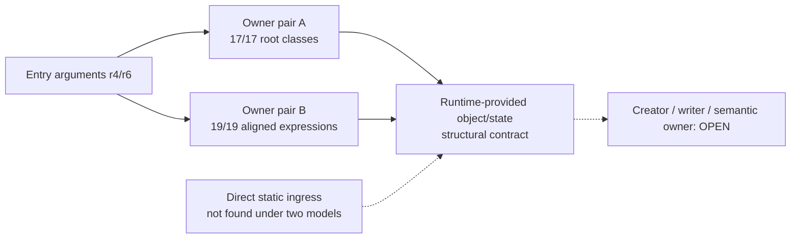

# Session 022 - Owner ingress and state-base provenance

- Date: 2026-07-23
- Objective: identify bounded static ingress to the two Session 021 owner
  pairs and determine whether their memory bases originate from static image
  pointers, call results or entry arguments.
- Mode: read-only static analysis; no firmware execution, modification,
  resource publication, repacking or vehicle access.
- Status: COMPLETE for adjacent literal/JSR, direct BSR, aligned address-taken
  and bounded expression-provenance models. Argument-rooted state is
  confirmed; creator, semantic owner and writer/loader remain open.

## Safety and evidence boundaries

The runner verifies the registered CD1/CD3 ISO hashes and the Session 003
principal-image hashes. Selected ISO members exist only in an operating-system
temporary directory and are removed after analysis.

Session 022 preserves these boundaries:

- a Session 021 owner window is not a recovered function;
- a raw `BSR` scan is syntactic without a complete executable map;
- an aligned in-image address is not automatically a callback;
- an entry argument is a runtime value with unknown creator;
- a stable memory-base expression does not identify a class or object type;
- no static result proves execution, path dominance or a zero-slot writer.

## Method

1. Re-read the two selected owner pairs from the deterministic Session 021
   report.
2. Decode each owner from its bounded prologue through the first return.
3. Search the complete images for adjacent PC-relative literal / same-register
   `JSR` forms and in-image direct `BSR` targets.
4. Test exact owner starts and every offset inside each owner window for
   external calls.
5. Enumerate four-byte-aligned in-image pointers targeting each window and
   require an exact PC-relative load before classifying their use.
6. Follow a loaded pointer for at most 16 instructions and distinguish an
   indirect control target, another call's argument, a memory base, overwrite
   or no modeled use.
7. Compare the fixed 16-word context of each address-taken load against all
   opposite-release PC-relative long loads.
8. For every bounded memory operand, trace its base backward to an entry
   argument, call return, image pointer, load, constant or unresolved origin.
9. Align memory-base rows through the complete owner-sequence mapping from
   Session 021 and compare canonical expressions and root classes.

## Findings

### S022-01 - No bounded direct static ingress reaches the owners

Across all four selected windows:

- exact-start adjacent literal/JSR calls: `0`;
- exact-start direct BSR calls: `0`;
- external adjacent literal/JSR calls into a window: `0`;
- external direct BSR calls into a window: `0`.

Status:
`NOT_FOUND_UNDER_ADJACENT_LITERAL_JSR_AND_BSR_MODELS`.

This is a bounded negative result. Indirect callbacks, computed jumps, runtime
tables and instruction/data separation outside the current model remain open.

### S022-02 - Two one-sided internal address uses exist

One aligned address-taken use occurs in each release:

| Release | Owner | Relative target | Modeled use |
|---|---:|---:|---|
| CD1 | A | `+34` | indirect control target |
| CD3 | B | `+58` | argument `r5` to another indirect call |

The CD1 load context has two exact CD3 matches. Both opposite windows have the
same 41-instruction normalized shape, three calls and one return, but neither
loaded value targets a selected owner window. The CD3 load context has no exact
CD1 match.

Status: `CONFIRMED_TWO_PC_RELATIVE_ADDRESS_TAKEN_USES` and
`bilateral_selected_owner_address_use = NOT_ESTABLISHED`.

The CD1 use is consistent with an internal alternate entry, and the CD3 use is
consistent with passing an internal code/data address. Those semantic labels
remain hypotheses because the target instructions were not executed.

### S022-03 - Owner A preserves argument-rooted state provenance

| Metric | CD1 | CD3 |
|---|---:|---:|
| Memory-base uses | 17 | 17 |
| Entry-argument-rooted uses | 8 | 8 |
| Load-rooted uses | 4 | 4 |
| Static-image-pointer-rooted uses | 0 | 0 |
| Resolved static calls | 8 | 8 |
| Unresolved indirect calls | 2 | 2 |

All 17 memory-base rows align. Root classes are identical for `17/17`.
Canonical expressions are identical for `13/17`. The four differences retain
the same `LOAD32[8](ENTRY:r4)` root while two field families change:

```text
CD1 +64   -> CD3 +72
CD1 +104  -> CD3 +112
```

Each expression occurs twice, giving four mismatched expressions with a
consistent `+8` displacement change.

Status: `CONFIRMED_ARGUMENT_ROOTED_BASE_PROVENANCE` and
`CONFIRMED_VERSIONED_FIELD_DISPLACEMENT_SHIFT`.

### S022-04 - Owner B preserves the same state-base expressions

| Metric | CD1 | CD3 |
|---|---:|---:|
| Memory-base uses | 21 | 21 |
| Entry-argument-rooted uses | 7 | 7 |
| Load-rooted uses | 4 | 4 |
| Call-return-rooted uses | 1 | 1 |
| Static-image-pointer-rooted uses | 0 | 0 |
| Resolved static calls | 10 | 10 |
| Unresolved indirect calls | 2 | 2 |

Nineteen memory-base rows align through the probable owner-sequence mapping.
All `19/19` aligned rows have identical canonical expressions and root
classes. Two rows are outside matching sequence blocks and are not inferred.

Status: `CONFIRMED_ALIGNED_BASE_EXPRESSION_IDENTITY` inside the prior
`PROBABLE_UNIQUE_SEQUENCE_OWNER_PAIR`.

### S022-05 - State arrives through runtime arguments, not static image roots

Across both releases and both owners:

- entry-argument-rooted memory uses: `30`;
- load-rooted memory uses: `16`;
- static-image-pointer-rooted memory uses: `0`.

The load-rooted uses descend from entry argument `r4`; they are not loads from
a statically resolved image base.

Status:

- `entry_argument_rooted_state_bases = CONFIRMED_IN_BOTH_OWNER_PAIRS`;
- `memory_load_rooted_state_bases =
  CONFIRMED_DYNAMIC_ARGUMENT_DEREFERENCE_BASES`;
- `static_image_pointer_rooted_state_bases =
  NOT_FOUND_IN_SELECTED_OWNER_WINDOWS`.

This supports a runtime-provided object or state contract. It does not identify
the creator, allocation site, class, task, subsystem or zero-slot writer.

## Operational graph v15

Graph v15 contains 39 nodes and 46 edges. It adds one
`CONFIRMED_BOUNDED_ANALYSIS` node and one
`CONFIRMED_STATE_PROVENANCE_BOUNDED_NEGATIVE_INGRESS` edge.



No edge represents observed runtime control flow.

## Phoenix SDK 0.20 deliverable

Session 022 adds:

- `phoenix_mmi.owner_provenance`;
- raw bounded BSR and aligned in-image-pointer indexes;
- PC-relative pointer-use classification;
- opposite-release fixed-context tests for address-taken uses;
- canonical memory-base provenance rooted in entry arguments, loads, call
  returns or static image pointers;
- pairwise aligned base-expression comparison;
- operational graph v15 correlation;
- a hash-gated Session 022 runner and five new unit tests.

The complete suite contains 84 passing tests.

## Limits

- A complete executable/data map is unavailable.
- Only adjacent literal/JSR and direct BSR calls are static ingress models.
- Pointer-use lookahead is limited to 16 instructions.
- The CD1 address-taken context has two opposite-release matches and is not
  unique.
- The CD3 address-taken context has no exact CD1 match.
- Two Owner B memory-base rows are outside aligned sequence blocks.
- Entry arguments have no incoming caller provenance yet.
- No writer, loader, allocator, semantic owner, FLDB parser, optical sector
  ABI, buffer provenance or dynamic compatibility is established.

## Next step

Recommended Session 023: trace the producers of entry arguments `r4` and `r6`
through bounded indirect-call descriptors and registration records. Use the
two one-sided internal address uses as secondary seeds, but require a unique
cross-version descriptor or caller contract before extending the graph. This
targets the state creator without turning the whole image into speculative
code.
