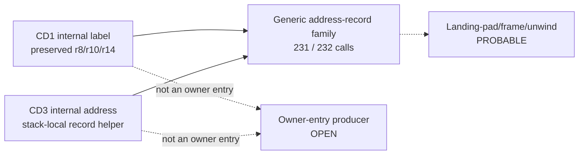

# Session 023 - Internal continuation and address-record contracts

- Date: 2026-07-23
- Objective: follow the two Session 022 address-taken seeds, recover their
  argument and preserved-register producers, and require a bilateral contract
  before extending the owner lineage.
- Mode: read-only static analysis; firmware was never executed or modified.
- Status: COMPLETE for the bounded internal-label and generic record-helper
  pass.

## Safety gates

The runner verifies the registered CD1/CD3 ISO sizes and SHA-256 values, checks
the extracted principal-image hashes against Session 003 and removes both
temporary members after analysis. Public artifacts contain offsets, generated
expressions, counts, hashes and evidence status only.

An address inside an owner window is not treated as an owner entry. A
landing-pad, frame or unwind label is not promoted without an identified ABI
or independent runtime evidence.

## Confirmed findings

### S023-01 - Both Session 022 seeds are internal labels

The CD1 seed is `+34` bytes inside Owner A. It has no entry prologue, fails the
standalone bounded-entry gate and reads `r8`, `r10` and `r14` before its first
call. The enclosing caller preserves:

- `r10 = ENTRY:r4`;
- `r9 = ENTRY:r6`;
- `r8 = 1`;
- `r14 =` its local frame.

The direct call therefore invokes an internal label with preserved-register
context. The ordinary `r4`-`r7` call arguments are not sufficient to model the
target as an ABI entry.

The CD3 seed is `+58` bytes inside Owner B. It also has no entry prologue,
fails the standalone entry gate and reads `r2` and `r14` before its first
call. It is passed as an in-image `r5` address to another helper, not invoked
at the selected site.

Status:

- `selected_addresses_are_owner_entries =
  DISPROVED_FOR_THE_TWO_SESSION022_INTERNAL_SEEDS`;
- CD1 role: `CONFIRMED_INTERNAL_LABEL_INDIRECT_INVOCATION`;
- CD3 role:
  `CONFIRMED_INTERNAL_ADDRESS_ARGUMENT_TO_RECORD_HELPER`.

### S023-02 - The CD3 helper initializes a bounded record

The CD3 helper is statically resolved. Its bounded window contains:

| Metric | Result |
|---|---:|
| Instructions | 30 |
| Known instructions | 28 |
| Known ratio | 93.3333% |
| Calls | 1 |
| Returns | 1 |
| Long-word fields based on entry `r4` | 6 |
| Field offsets | `0, 4, 8, 12, 16, 24` |
| Modeled `r7` operand mentions | 0 |

At the selected call, `r4` is a stack-local frame address, `r5` is the
internal Owner B address, and `r6`/`r7` are loaded from offsets `24`/`40` of
the enclosing entry `r4`.

The field geometry is confirmed. Values flowing through conditional branches
are deliberately not assigned to fields because path dominance is not proven.

### S023-03 - A broad cross-version address-record call family exists

The helper's adjacent-call family is highly regular:

| Metric | CD1 / 5150 | CD3 / 5570 |
|---|---:|---:|
| Adjacent literal/JSR calls | 231 | 232 |
| Calls with in-image address in `r5` | 231 | 232 |
| Unique in-image `r5` targets | 150 | 151 |

For the 232 CD3 contexts:

- 188 have one unique CD1 context match;
- 27 have ambiguous CD1 matches;
- 17 are unmatched;
- 215 converge on one dominant CD1 target;
- dominant-target coverage is `92.6724%`.

This passes the fixed Session 018 family gate. It confirms a structural
cross-version address-record family, not runtime equivalence.

### S023-04 - The selected CD3 use remains one-sided

The selected helper load is non-adjacent to its call because three argument
setup instructions intervene. Its fixed 16-word context has zero exact CD1
matches.

The helper's 30-word normalized shape occurs three times in each release. Only
the selected CD3 copy receives the 232 adjacent calls; none of the three exact
CD1 shape copies receives an adjacent call. Shape identity alone therefore
cannot select a bilateral counterpart.

### S023-05 - Compiler frame/landing-pad semantics remain probable

The combination of stack-local destination records, ubiquitous in-image `r5`
addresses, internal non-entry labels and a stable helper family is consistent
with compiler-generated landing-pad, frame or unwind registration.

Status: `PROBABLE_NOT_CONFIRMED`.

No exception/unwind ABI, compiler metadata format or runtime behavior was
identified. The evidence must not be described as a confirmed callback,
exception handler or application-owned registration record.

## Effect on owner provenance

Session 023 closes the tempting but incorrect shortcut from an internal
address to an owner entry. The two seeds do not identify:

- an incoming owner-entry caller;
- the state-object creator;
- the runtime-linkage writer or loader;
- the Session 017 descriptor producer;
- an FLDB parser, sector ABI or optical-buffer owner.

RQ-065 therefore remains open, with these two seed paths excluded as direct
owner-entry provenance.

## Operational graph v16

Graph v16 contains 40 nodes and 47 edges: 32 confirmed nodes, four probable
nodes, two open nodes and six bounded-negative edges. It adds one confirmed
bounded-analysis node and a structural edge recording that the two seeds are
internal labels rather than owner entries.

No edge represents observed runtime execution.

## Phoenix SDK 0.21 deliverable

Session 023 adds:

- `phoenix_mmi.continuation_contract`;
- delay-slot-aware `r4`-`r14` producer tracing;
- internal-label live-in diagnostics;
- normalized helper-shape census;
- stack-record field geometry;
- cross-version address-argument call-family correlation;
- operational graph v16;
- a hash-gated Session 023 runner and five new unit tests.

The complete suite contains 89 passing tests.

## Limits

- Owner windows and internal labels are not asserted function boundaries.
- The helper family gate uses fixed 16-word normalized contexts.
- The selected CD3 helper call is outside the adjacent-load/call census.
- Conditional field values are not assigned without path dominance.
- A complete executable/data map and exception/unwind ABI are unavailable.
- Runtime execution, task ownership and dynamic compatibility are unobserved.

## Next step

Recommended Session 024: return to the selected owners themselves and trace
their entry `r4`/`r6` values through memory-loaded indirect callers rather than
internal labels. Begin from call-return and field-load producer shapes already
registered in Sessions 016-022; require the same receiver/argument expression
and a unique target family in both releases before extending the graph.
