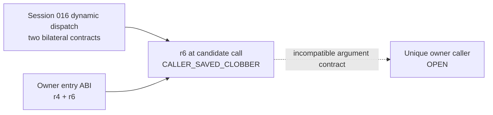

# Session 024 - Owner-entry indirect-caller compatibility

- Date: 2026-07-23
- Objective: test the registered call-return/field-load indirect dispatches
  against the actual `r4`/`r6` entry contract of the selected owner pairs.
- Mode: read-only static analysis; firmware was never executed or modified.
- Status: COMPLETE for the bounded Session 016 candidate family.

## Safety gates

The runner verifies registered ISO size and SHA-256, verifies both extracted
principal-image hashes against Session 003 and removes temporary members after
analysis. It does not scan every aligned word as code, execute firmware, alter
media or publish extracted content.

Only two candidates already registered as cross-version dynamic descriptor
contracts in Session 016 are tested. A matching call shape is never promoted
to a method, vtable, function or concrete target.

## Confirmed findings

### S024-01 - Both owner pairs require entry `r4` and `r6`

The Session 022 state-base profiles independently retain the same bilateral
entry roots in both owner pairs:

| Owner pair | Required entry arguments | Result |
|---:|---|---|
| 1 | `r4`, `r6` | confirmed in CD1/CD3 |
| 2 | `r4`, `r6` | confirmed in CD1/CD3 |

`r4` roots direct and loaded state bases. `r6` supplies a base used with
constant displacement `+2`. This is an ABI/dataflow contract only; argument
types and object identity remain unknown.

### S024-02 - The two registered indirect contracts are bilateral and unique

For each Session 016 seed, Phoenix produced a fixed 16-word normalized context
centered on the indirect `JSR`.

| Candidate | CD1 matches | CD3 matches | Cross-version signature | Target expression |
|---:|---:|---:|---|---|
| 1 | 1 | 1 | equal | equal, unresolved |
| 2 | 1 | 1 | equal | equal, unresolved |

Both retain the same call-return/field-load target path and the same receiver
expression:

```text
target = LOAD32[12](LOAD32[0](LOAD32[0](CALL_RETURN)))
r4     = ADD(LOAD32[0](CALL_RETURN),
             LOAD16[0](ADD(LOAD32[0](LOAD32[0](CALL_RETURN)), CONST:8)))
```

The equality is structural. No concrete runtime target or unique owner-entry
target family is established.

### S024-03 - Every candidate fails the required `r6` gate

At both candidate sites, in both releases:

```text
r6 = CALLER_SAVED_CLOBBER
```

A preceding call supplies the return-rooted descriptor path while invalidating
the modeled caller-saved provenance of `r6`. The selected owners later consume
entry `r6`, so these call contracts cannot supply the complete bilateral owner
entry contract.

There are four candidate/owner-pair combinations. Zero pass.

Classification:

```text
session016_call_return_field_load_family_as_owner_caller =
  BOUNDED_NEGATIVE_INCOMPATIBLE_ENTRY_ARGUMENT_CONTRACT
```

This excludes only the tested Session 016 family under the documented
linear-predecessor model. It does not prove that no indirect owner caller
exists.

### S024-04 - Producer and creator remain open

Session 024 does not identify:

- a unique incoming owner-entry caller;
- a concrete memory-loaded target;
- the producer of entry `r4`/`r6`;
- a state-object creator or runtime writer;
- the semantic owner identity;
- an FLDB parser, sector-read ABI or optical-buffer owner.

RQ-065 therefore remains open with one additional candidate family excluded.

## Operational graph v17

Graph v17 contains 41 nodes and 48 edges: 33 confirmed nodes, four probable
nodes, two open nodes and seven bounded-negative edges. It adds a bounded
negative compatibility node and one edge documenting that the Session 016
family cannot supply owner entry `r6`.



No edge represents observed runtime execution.

## Phoenix SDK 0.22 deliverable

Session 024 adds:

- `phoenix_mmi.owner_caller`;
- fixed, normalized indirect-`JSR` signature census;
- bilateral owner-entry argument extraction;
- target/receiver/argument compatibility gates;
- explicit caller-saved-clobber rejection;
- operational graph v17;
- a hash-gated Session 024 runner and five new unit tests.

The complete suite contains 94 passing tests.

## Limits

- Candidate scope is exactly the two Session 016 dynamic descriptor contracts.
- Fixed signatures do not constitute a complete executable map.
- Linear backward slicing does not prove path dominance.
- Owner windows are not asserted function boundaries.
- Memory-loaded targets remain unresolved.
- Runtime execution, object identity and dynamic compatibility are unobserved.

## Next step

Recommended Session 025: build a producer-first candidate set containing only
prologue-backed, cross-version indirect-call contexts that materialize both
`r4` and `r6` after their last preceding call. Require bilateral canonical
argument equality before attempting target lineage. Keep the search seeded by
registered code windows and exclude arbitrary raw-image decoding.
