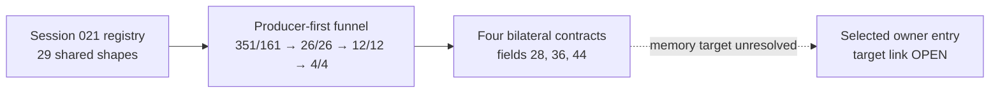

# Session 025 - Producer-first owner-caller candidates

- Date: 2026-07-23
- Objective: find cross-version indirect-call contexts that explicitly
  rebuild the complete `r4`/`r6` owner-entry contract after their last
  preceding call.
- Mode: read-only static analysis; firmware was never executed or modified.
- Status: COMPLETE for the registered Session 021 shared-owner boundary.

## Safety gates

The runner verifies the registered ISO sizes and SHA-256 values, checks both
principal-image hashes against Session 003 and removes temporary members after
analysis.

The code boundary is inherited from Session 021. Phoenix decodes only
prologue-backed, code-gated pointer-zero owner windows whose exact normalized
shape occurs in both releases. It does not decode arbitrary image regions or
infer a complete executable map.

An argument-compatible call remains a candidate until its unresolved target
is independently linked to a selected owner entry.

## Confirmed findings

### S025-01 - The Session 021 registry reproduces exactly

All four per-release census fields and all three bilateral counts match the
published Session 021 evidence:

| Metric | CD1 / 5150 | CD3 / 5570 |
|---|---:|---:|
| Active pointer-zero targets | 199 | 112 |
| Active pointer-zero calls | 1,567 | 319 |
| Prologue/code-gated owners | 1,206 | 243 |
| Exact accepted owner shapes | 485 | 184 |
| Instances in shared shapes | 235 | 44 |

There are 29 shared exact prologue shapes. This proves reproducibility of the
search boundary, not semantic ownership of those windows.

### S025-02 - The producer-first funnel is narrow and symmetric

| Gate | CD1 | CD3 |
|---|---:|---:|
| Indirect `JSR` decoded inside admitted instances | 351 | 161 |
| Unresolved memory-loaded target | 26 | 26 |
| Explicit `r4` and `r6` after the last call | 12 | 12 |
| Available `r4` and `r6` provenance | 4 | 4 |

The first count differs because shared shapes have 235 CD1 and 44 CD3
instances. From the memory-target gate onward, the counts converge exactly.

All twelve explicit call positions occur bilaterally. Eight retain unavailable
argument provenance and are rejected rather than carried forward.

### S025-03 - Four argument-compatible families remain

Each promoted family has one CD1 and one CD3 instance and one equal canonical
target/`r4`/`r6` tuple.

| Family | Target field | Receiver adjustment input | `r6` |
|---:|---:|---:|---|
| 1 | 28 | 24 | `0` |
| 2 | 36 | 32 | `0` |
| 3 | 44 | 40 | `ENTRY:r7` |
| 4 | 44 | 40 | `ENTRY:r7` |

Their common grammar is:

```text
target = LOAD32[field](LOAD32[0](CALL_RETURN))
r4     = ADD(CALL_RETURN,
             LOAD16[0](ADD(LOAD32[0](CALL_RETURN), field - 4)))
```

The two field-44 contracts occur in different shared owner shapes. They are
kept as separate families.

Classification:

```text
owner_entry_argument_compatible_dispatches =
  CONFIRMED_FOUR_STRUCTURAL_CANDIDATE_FAMILIES
```

This confirms a stable dispatch grammar and complete argument availability.
It does not identify the callee.

### S025-04 - No selected-owner target edge exists yet

All four targets remain dynamic memory loads. Session 025 finds no concrete
target address and no independent relation to either Session 021 selected
owner entry.

The following remain open:

- unique bilateral owner-entry caller;
- producer of the call-return-rooted descriptor/object;
- selected-owner target registration;
- state-object creator or writer;
- semantic class or subsystem owner;
- FLDB parser, sector ABI and optical-buffer provenance.

## Operational graph v18

Graph v18 contains 42 nodes and 49 edges: 34 confirmed nodes, four probable
nodes, two open nodes and seven bounded-negative edges. It adds one structural
candidate node and one open target-link edge.



No edge represents observed runtime execution.

## Phoenix SDK 0.23 deliverable

Session 025 adds:

- `phoenix_mmi.owner_producer`;
- exact reproduction of the Session 021 owner registry;
- bounded shared-owner instance decoding;
- last-call and delay-slot-aware `r4`/`r6` definition gates;
- unavailable-root rejection;
- bilateral canonical target/argument family correlation;
- operational graph v18;
- a hash-gated Session 025 runner and six new unit tests.

The complete suite contains 100 tests.

## Limits

- Only the 29 Session 021 shared exact prologue shapes are decoded.
- Global literal-call discovery remains a syntactic registry reconstruction.
- Exact normalized shapes are not semantic owner classes.
- Linear backward slicing does not prove path dominance.
- Owner windows are not asserted function boundaries.
- Memory-loaded targets and object types remain unresolved.
- Runtime execution and dynamic compatibility are unobserved.

## Next step

Recommended Session 026: trace the immediately preceding producer calls that
supply `CALL_RETURN` for the four candidates. Require bilateral producer
callee/context agreement and returned-object field geometry before testing
whether any target registration can reach a selected owner entry.
